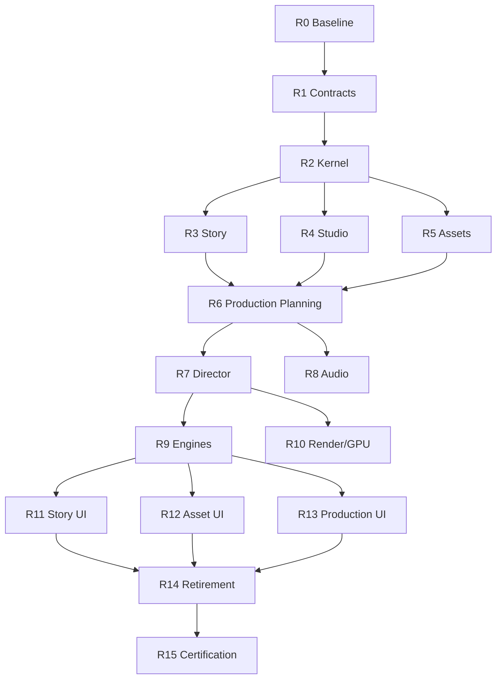

# WindAgent Studio — Full Codebase Audit & Refactor Roadmap (Final Report)

Date: 2026-08-09 · Repo: D:\code_ca_nhan\WindAgent @ fd36123 · Method: 6 parallel evidence passes + direct verification + live checker runs. Read-only.

---

## 1. Executive Summary

**WindAgent today** is a verified, evidence-driven **modular monolith** — a general-purpose local-first AI agent runtime: FastAPI V2 API (22 routers, V1 tombstoned), durable Worker (queue/lease/atomic finalize/outbox), CLI (11 commands), Tauri desktop, 18 uv workspace packages, 573 Python files, **2,428 tests / 246 files**, 22 frontend specs, 16-job CI matrix, artifact-protocol evidence culture, and a **complete video production pipeline (VP3D phases 0–26) certified with REAL Blender 4.5.12 LTS + ffmpeg evidence** — but that pipeline is wired into the runtime only behind env guards.

**WindAgent should become WindAgent Studio** — an AI Animation / Video Production System: Idea → Research → Story → Screenplay → Production Planning → Asset → Audio → 3D Scene → Render → Edit → Final Video. The generic agent framework shrinks to a runtime kernel serving the two domains (Story/Script + Video Production).

**Headline verdict: WIND_STUDIO_REFACTOR_READY_WITH_BLOCKERS.** The foundation is unusually strong (canonical IR, engine port, workflow packs, fail-closed gates, 2,428-test safety net). Blockers are boundary-hygiene + evidence-integrity + runtime-wiring, not architecture invention.

## 2. Current Architecture

```mermaid
flowchart TD
    subgraph apps
        API[apps/api V2 — 22 routers]
        WK[apps/worker — durable queue]
        CLI[apps/cli — 11 cmds]
        D[apps/desktop — 14 tabs]
        WEB[apps/web — stub shell]
    end
    subgraph kernel
        ORCH[orchestration: OrchestratorService + DurablePlanScheduler + Recovery]
        INT[intelligence: pipeline classifier+planner]
        PROV[providers: 10 adapters V3 routing]
        TOOL[tools: 12 builtin + media_assets + blender]
        WF[workflows: packs + video_production 16-step]
        STOR[storage: event store + outbox + queue + alembic]
        CORE[core: domain incl. video_production 90+ files + 13 video contracts]
        VER[verification: 7 gates] SUPP[context/memory/execution/observability/plugins/skills]
    end
    API --> ORCH; WK --> ORCH; WK --> STOR
    API --> CORE; WK --> CORE
    INT --> PROV; API --> INT
    WF --> ORCH; TOOL --> CORE
    subgraph video-test-only
        VID[intelligence/video: golden_scene, episode, audio, reviewers...]
        ENG[BlenderEngineAdapter — env-guarded]
    end
    VID -.TEST_ONLY.-> TESTS[tests/phase25/26 evidence]
    ENG -.guard.-> WK
    subgraph frontend-inert
        FU[frontend/production-ui packages]
        FA[FakeProductionApiClient]
    end
    FU -.NOT_WIRED.-> FA
```

## 3. Target Architecture

```mermaid
flowchart TD
    subgraph apps
        API[apps/api] WK[apps/worker] CLI[apps/cli] D[desktop /story /assets /production]
    end
    subgraph core-kernel
        CORE[core: domain/contracts/events/errors/config/security]
        ORCH[orchestration kernel] STOR[storage] PROV[providers] VER[verification]
    end
    subgraph studio-domains
        ST[studio: projects/production_state/project_bible]
        S[story: research/ideas/development/screenplay/review]
        P[production: director/scenes/shots/camera/animation/lighting/audio/render/editing/manifest]
        A[assets: registry/acquisition/generation/validation/licensing]
    end
    subgraph engines
        E[engines: blender/unreal/ffmpeg/tts/image_gen]
    end
    API --> S; API --> P; API --> A; API --> ST
    WK --> ORCH; ORCH --> P; P --> E; S --> P; A --> P
    D --> API
    CORE --> S; CORE --> P; CORE --> A
```

## 4. Architecture Delta

| | CURRENT | TARGET |
|---|---|---|
| Story | screenplay core + orphaned writer chain; no bibles/beat sheet; research unwired | story/ package; full Idea→Locked Script pipeline wired; eval gates complete |
| Production | canonical core models + TEST_ONLY orchestrators + env-guarded adapter | production/ package; manifest-driven; default-on worker path |
| Engine | Blender adapter behind port (correct), env-guarded, CPU-only | engines/ package; Blender default-on + GPU; Unreal on same port |
| Assets | mature trust/provenance; no acquisition/registry/licensing | assets/ package with acquisition + registry + licensing |
| Frontend | session-chat UI + inert production packages + fake client + arcade game | /story /assets /production workspaces on real API |
| Generic runtime | full agent framework | kernel only (orchestration/storage/providers/verification) |
| Boundaries | 13 violations (core→storage), stale evidence | clean core; evidence regenerated per commit |

## 5. Keep / Move / Refactor / Rewrite / Archive / Delete Summary

- **KEEP (bulk of the system)**: core/domain/video_production (90+ files), all 13 core video contracts + ProductionEnginePort, orchestration control plane (OrchestratorService/DurablePlanScheduler/RecoveryManager/queue), storage (event store/outbox/atomic finalize), all 10 providers, 12 builtin tools, verification gates, context/memory/execution/observability/plugins/skills, video_production workflow pack, evals harness, API+Worker+CLI entrypoints, tests/scripts/artifacts/docs, quarantined third_party/videoclaw.
- **MOVE**: intelligence/video/* → story/ + production/; tools/production_engines/blender → engines/blender; tools/media_assets → assets/; social_research → story/research; story models (screenplay*, ideation, character_master) → story/.
- **REFACTOR**: apps/desktop (god components, tab surgery, de-stub), intelligence summarizer/reviewer/reporter (wire or retire), dead WorkflowEngine path removal, core↔storage boundary repair.
- **REWRITE**: none required. (apps/web would be ARCHIVE/DELETE, not rewrite.)
- **ARCHIVE**: external/, legacy_v1/ (after sunset), generic packs (decision pending).
- **DELETE (evidence-backed)**: apps/backend (empty), src/data_generator.py (orphan), tools/adapters/legacy_tools.py + core/adapters/legacy_mappers.py (superseded), tools/plugins + tools/skills (empty), api/adapters/legacy_event_mappers.py, --demo twins (decision), apps/web (decision).

## 6. Critical Findings (top 15)

1. **ProductionEnginePort + typed IR already exist and are engine-neutral** (core/contracts/video_production/production_engine.py:35; production_ir/models.py) — target §3.3 is already implemented; Blender is already an adapter. No rewrite.
2. **The whole video pipeline is TEST_ONLY** — golden_scene (P25) and episode (P26) orchestrators never run in the worker; only evidence producers exercise them (real Blender subprocesses). Env guards gate the adapter (worker composition.py:216-222).
3. **ProductionManifest aggregate does not exist** (0 hits) — IR is per-shot; whole-episode aggregate + Project model missing (frontend hardcodes proj-alpha).
4. **Architecture checker LIVE FAIL 13** (5 cycles core↔storage, 4 disallowed core→storage, 4 undeclared deps) while committed evidence says PASS — evidence drift; core boundary must be repaired before domain extraction.
5. **Story front-of-pipeline missing**: StoryBible, WorldBible, BeatSheet, creative EpisodeOutline = 0 hits. RESEARCH exists but unwired (social_research, CLI-only).
6. **Story generation chain orphaned**: brief_expander → outliner → ScreenplayWriter → narrator complete, nothing calls it (only a comment references the writer).
7. **Screenplay lock validation hardcodes 3 character ids** instead of consulting CharacterMaster (screenplay_validation.py:67).
8. **script_eval 2/16 phases** — no quantitative story-quality gate beyond idea stage.
9. **Frontend production UI built but inert**: FakeProductionApiClient + hardcoded proj-alpha (ProductionWorkspacePage.tsx:13-21); real asset UI stranded behind dead tab; screenplay/collab views dead code; 5 frontend packages imported by nothing.
10. **Router.tsx is a 2,564-line god component with an embedded arcade game** and mock fallback on API failure.
11. **Durable orchestration is genuinely solid**: atomic CAS finalize with fencing, outbox worker-owned, leader-leased recovery in both processes, immutable plan revisions, SQL SKIP LOCKED queue.
12. **Version/evidence integrity drift**: version-consistency live FAIL (1 hardcoded literal), desktop version hardcoded 1.2.0 vs 0.6.0/0.3.0, VERIFICATION_REPORT stale (phases 0-6 only).
13. **No release automation**; ci_remote.yaml duplicates ci.yaml; long git tail of timestamp-refresh commits.
14. **GPU rendering absent** (CPU-only); VRAM budget + chunk leases ready for it (render_jobs.py, vram_budget.py).
15. **No duplicate domain models** (checkers PASS + manual scan) — the codebase's layer splits (core model ↔ IR projection ↔ engine manifest ↔ receipt DTO) are deliberate and clean. legacy_v1/ is sunset-bounded.

## 7. Reusable Foundation (verified)

- **Workflow engine layer**: OrchestratorService DAG control plane, DurablePlanScheduler, MultiAgentRepository (immutable plan revisions), RecoveryManager, SqlDurableTaskQueue, atomic finalize, outbox — the durable runtime backbone. KEEP as-is.
- **Provider layer**: 10 adapters, V3 routing (endpoint failover, circuit breaker, cooldown, route locks), response cache, canonical model registry, gateway bridge, audited usage ledger. KEEP all.
- **Verification/evidence**: 7 quality gates, artifact protocol w/ schema + hash verification, per-phase verdict JSONs, CI evidence bundles, fail-closed negative fixtures. KEEP and extend per phase.
- **Video domain**: production_ir, engine port, Blender adapter + runtime supervision + scene pipeline + determinism/idempotency, chunk leases + fencing, intelligent retry, technical reviewers, VRAM budgets, golden-scene/episode orchestrators, audio pipeline (TTS port + alignment + mix), postproduction assembly, media_assets security/trust/provenance. All evidence-backed — MOVE, never rewrite.
- **Story domain**: Fountain parser/serializer, semantic diff, AI proposals with human approval, lock gate, director service (locked-screenplay gate), continuity ledger, CharacterMaster (DRAFT→APPROVED), collaboration proposals + timeline, approval machinery.

## 8. Story Readiness: ~55%

Strong: screenplay core (parse/diff/propose/lock), character master, approval, director. Missing: bibles (story/world), beat sheet, creative outline, research wiring, story review, eval completion (2/16), runtime wiring of the generation chain, validation↔character linkage.

## 9. Video Production Readiness: ~65%

Strong: IR + engine port + adapter + golden-scene/episode orchestrators + audio + postproduction + reviewers + retry + VRAM + chunk leases — certified by real-run evidence. Missing: runtime wiring (env guard), GPU, ProductionManifest aggregate, acquisition backend, frontend connectivity, Unreal (optional).

## 10. Major Missing Capabilities

1. ProductionManifest aggregate + Project model (R1/R4/R6)
2. StoryBible / WorldBible / BeatSheet / creative EpisodeOutline (R1/R3)
3. Research→story wiring (R3)
4. Story review agent + script_eval phases 3–15 (R3)
5. Runtime wiring of the entire production pipeline (R7–R9)
6. GPU rendering + multi-instance engine pool (R10)
7. Internet asset acquisition + licensing registry (R5)
8. Music/SFX generation (R8)
9. Production run-status/monitoring API + frontend (R10/R13)
10. Release automation + evidence regeneration in CI (R0/R15)

## 11. Migration Roadmap (see 20_refactor_roadmap.md for full phase specs)

```
R0 Baseline & Evidence Repair   (LOW/LOW)
R1 Canonical Contracts          (MED/LOW)   — story contracts, Project/Production/Audio manifests
R2 Runtime Kernel Cleanup       (MED/MED)   — core boundary, dead orchestration path, studio skeleton
R3 Story Domain                 (HIGH/MED)  — move+wire generation chain, research, eval completion
R4 Studio/Project Domain        (MED/LOW)
R5 Asset Domain                 (MED/MED)   — registry, acquisition, licensing
R6 Production Planning          (HIGH/MED)  — production/ package, manifest-driven episodes
R7 Director Layer               (MED/LOW)
R8 Audio Pipeline               (MED/MED)   — parallel TTS, AudioManifest
R9 Engine Adapters & Wiring     (HIGH/HIGH) — Blender default-on, Unreal skeleton
R10 Render/Review/Retry/GPU     (HIGH/MED)
R11 Frontend Story              (MED/LOW)
R12 Frontend Assets             (MED/LOW)
R13 Frontend Production         (HIGH/MED)  — real client, monitoring, de-god Router.tsx
R14 Generic Runtime Retirement  (LOW/LOW)   — evidence-backed deletions
R15 Final Integration & Certification
```

## 12. Dependency Graph



## 13. Parallel Execution

- **Phases**: R3 ∥ R4 ∥ R5 (after R2); R7 ∥ R8 (after R6); R10 ∥ R11/R12/R13 (after R9); R11 ∥ R12 ∥ R13.
- **Pipeline (proven)**: ASSET_PREP ∥ AUDIO_PREP (P26, asyncio.gather); chunk-level render leases + fencing ready; per-scene parallel needs multi-instance engine (R10); TTS parallel per voice (R8); ordering determinism enforced by EpisodeOrderingReceipt.

## 14. Risk Register (top — full list in 22)

RSK-02 module relocation breaks evidence producers (HIGH LIKELIHOOD) · RSK-03 TEST_ONLY integration debt (HIGH IMPACT) · RSK-01 core boundary fix on hot path · RSK-06 evidence drift recurrence · RSK-07 GPU perf gate (≤3h/20min) machine-bound · RSK-10 mock fallbacks mask failures. Mitigations: facade re-exports, move-tests-with-modules rule, CI evidence regeneration, benchmark-first GPU work.

## 15. Recommended First Phase

**R0.1 (Evidence Repair) then R1.1 (Story Contracts).** Reasons: (a) R0.1 unblocks trust — every later gate depends on trustworthy checkers/evidence; (b) R1 contracts are additive, zero-risk, and unblock R3/R4/R6; (c) no runtime touched until R2/R3, so the 2,428-test safety net is never stretched while learning the new seams. Concretely: fix the version-consistency literal, regenerate both stale evidence bundles in CI, publish VERIFICATION_REPORT v2 for phases 7–26, then freeze StoryBible/WorldBible/BeatSheet/EpisodeOutline contracts with contract tests. Exit gates: WIND_STUDIO_R0_EVIDENCE_REPAIRED, WIND_STUDIO_R1_STORY_CONTRACTS_CANONICAL.

---

## Answers to the 25 questions (§29)

1. **Subsystems today**: API V2 (22 routers), Worker (durable), CLI, Desktop, Web stub; core (domain+contracts+events+errors+config+security); orchestration (DAG control plane + recovery); intelligence (pipeline + 25 video modules); providers (10); tools (12 builtin + media_assets + blender engine); workflows (8 packs + video_production + social_research); storage (event store/outbox/queue/alembic 3 generations); verification (7 gates); context/memory/execution/observability/plugins/skills/evals; frontend monorepo (5 inert packages); evidence/artifact infra; quarantined third_party.
2. **Code serving Story+Video**: roughly 45–50% of production code by package surface — core/domain/video_production (90+ files), 13 video contracts, intelligence/video (25 modules), blender engine (~25 files), media_assets (~15), video_production workflow, social_research, screenplay API routers, frontend production packages, phase tests + evidence.
3. **General-purpose framework**: roughly 35–40% — orchestration control plane, providers, tools, storage, support packages, generic packs, generic CLI/desktop agent UI.
4. **Keep as-is**: everything in §7 — orchestration kernel, providers, storage, verification, context/memory/execution/observability, core contracts, canonical video domain, quarantine.
5. **Move only**: intelligence/video → story/+production/, blender → engines/, media_assets → assets/, social_research → story/research/, story models → story/.
6. **Refactor**: desktop UI, dead WorkflowEngine path, core↔storage boundary, unused summarizer/reviewer/reporter.
7. **Rewrite**: none required (verified).
8. **Archive/delete**: external/, legacy_v1/ (sunset), apps/backend, src/data_generator.py, legacy shims, empty tools dirs, apps/web (decision), generic packs (decision).
9. **Duplicated domain models**: none exact. All near-dups are intentional layer splits. legacy_v1 = bounded sunset compat.
10. **Canonical workflows**: OrchestratorService DAG control plane + durable task queue/finalize = canonical runtime; video_production 16-step pack = canonical production workflow (needs story-stage extension); golden_scene/episode orchestrators = canonical execution pipelines (to be wired).
11. **Overlapping agents**: summarizer/reviewer/reporter overlap partially; screenplay AI proposal + director revision + (future) story review risk triple coverage — one review flow to be defined (R3). No agent-to-agent direct calls exist.
12. **Production logic Blender-specific?** No — behind ProductionEnginePort + typed IR; adapter compiles IR. Blender-specificity confined to tools/production_engines/blender + execute_job.py scripts.
13. **Blender as adapter without rewrite?** Yes — already done. R9 = relocation + default-on, zero engine rewrite.
14. **Asset system strong enough?** Mostly — security/trust/provenance/normalization certified (VP7). Gaps: acquisition backend, registry persistence, licensing, resolution chain wiring.
15. **Story system strong enough?** No — 55%. Screenplay core strong; bibles/beat sheet/research/wiring/eval missing.
16. **Audio parallel?** DAG + TTS dedup ready; asset+audio prep parallelism proven (P26); per-voice TTS wiring + Music/SFX missing.
17. **ProductionManifest form today**: per-shot typed IR (ProductionIrDocument) + run manifests (GoldenSceneRunManifest/EpisodeRunManifest) + ordering receipt + asset cache entries. Aggregate whole-episode manifest missing.
18. **Canonical contracts to add**: ProjectManifest, StoryBible, WorldBible, BeatSheet, EpisodeOutline (creative), ProductionScript, ScenePlan (approved), ShotPlan (aggregate), AssetManifest (registry), AudioManifest (aggregate), ProductionManifest (aggregate), RenderManifest (engine-neutral), ReviewReport (API-exposed). See 16.
19. **Frontend reuse**: ~60% — 5 production packages built+tested (screenplay editor suite, asset workspace, RTK slices, Http client); work = wiring + de-stub + tab surgery.
20. **Generic UI/runtime not needed**: apps/web stub, agent-registry/permission/task-edit stubs, Router game/mocks, demo twins (decision), generic packs (decision).
21. **Minimum stages**: 16 (R0–R15) with ~27 phases; R0–R2 are prerequisites, R3–R13 domain+frontend, R14–R15 closeout.
22. **Parallel stages**: R3∥R4∥R5; R7∥R8; R10∥R11-13; R11∥R12∥R13.
23. **Biggest blocker**: architecture boundary integrity — core→storage leak (13 live violations) + stale PASS evidence. Fix R0.1/R2.1 before domain extraction.
24. **First phase**: R0.1 evidence repair, then R1.1 story contracts (additive, zero-risk).
25. **Success criteria**: WIND_STUDIO_CERTIFIED — a full idea→final-video run executes through the real runtime (worker + engines, no env guard, no fake client), all checkers PASS with fresh evidence, 2,428+ tests green, legacy runtime removed, and the studio story/production/asset/frontend surfaces all live.

---

## Verdict

```
WIND_STUDIO_REFACTOR_READY_WITH_BLOCKERS
```

**Reason**: The codebase already contains ~65% of the target architecture as verified, evidence-backed code (engine port, typed IR, orchestrators, asset security, verification culture). The migration is relocation + wiring + contract addition — NOT a rewrite. But three blockers must be cleared before domain extraction starts.

**Blocking findings**:
- B-1: core↔storage boundary violations (13 live, evidence claims PASS) — TD-01/TD-02
- B-2: version-consistency evidence stale + live FAIL — TD-03
- B-3: VERIFICATION_REPORT aggregate stale (phases 7–26 uncertified in one report) — TD-13

**Required preconditions**: R0.1 (evidence repair) + R2.1 (core boundary) complete; studio boundary policy defined (R2.3); R1 contracts frozen.

**Recommended first phase**: R0.1 — regenerate evidence at the certified commit, fix version literal, publish VERIFICATION_REPORT v2; then R1.1 story contracts. Exit gates WIND_STUDIO_R0_EVIDENCE_REPAIRED → WIND_STUDIO_R1_STORY_CONTRACTS_CANONICAL.

*Full detail: 00–23 report files in this directory. All findings carry file:line evidence; unknown items marked UNKNOWN in 23_open_questions.md.*
