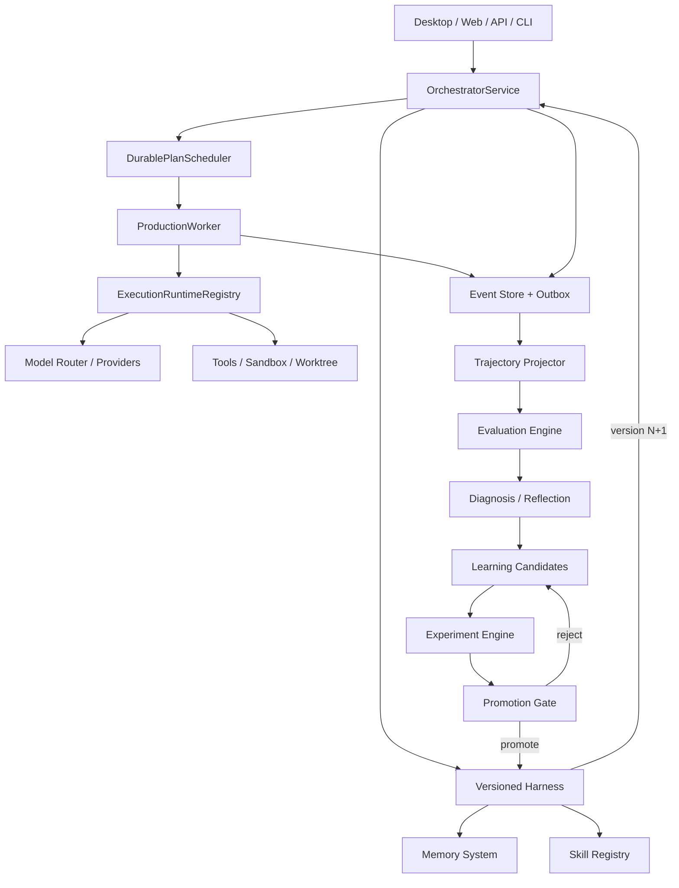
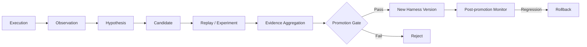
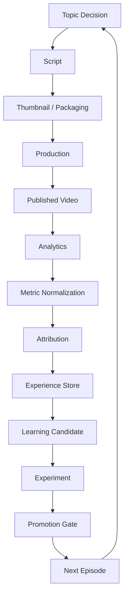

# WINDAGENT ROADMAP — PRIME-AGENT-INSPIRED AUTONOMOUS & SELF-IMPROVING ARCHITECTURE

**Baseline repository:** `WindFaculty/WindAgent`
**Baseline commit:** `0f869d16cb0bc850d6e5097db0d8bc1089cb9d49`
**Roadmap objective:** nâng WindAgent từ một durable multi-agent/content platform thành một **production-grade long-running autonomous agent platform có controlled self-improvement**.

---

# 1. EXECUTIVE DIRECTION

Không copy Prime Agent theo kiểu:

```text
Prime Agent
    ↓
port toàn bộ architecture
    ↓
WindAgent
```

Mà phải:

```text
Prime mechanisms
        ↓
extract architectural principles
        ↓
map vào architecture WindAgent hiện tại
        ↓
reuse existing authorities
        ↓
fill missing capabilities
        ↓
strengthen safety/evaluation
```

Prime Agent hiện xoay quanh hai abstraction chính:

```text
Recursive Language Model
+
Continual Harness
```

kết hợp persistent Python environment, recursive subagents, background sessions, compaction, goals, scheduling và refinement của supplemental harness state. Prime cũng giữ provider/session/lifecycle/scheduling authority ở host thay vì để Python kernel sở hữu authoritative state.

## WindAgent target

Không nhắm ngay tới:

```text
fully autonomous self-modifying agent
```

Mà đi theo:

```text
Durable Agent
↓
Observable Agent
↓
Evaluated Agent
↓
Learning Candidate Generator
↓
Controlled Self-Improvement
↓
Closed-loop Optimization
```

Mức trưởng thành mục tiêu:

```text
Current verified state
≈ Level 2

Phase 10 target
= Level 5

Final target
= Level 6
```

Theo rubric:

```text
0 no learning
1 conversation memory
2 persistent memory
3 experience → reusable instruction
4 experience → prompt/skill modification
5 modification + evaluation
6 automatic closed-loop optimization
7 self-improving multi-agent organization
```

WindAgent hiện có persistent memory, nhưng source hiện tại chưa đủ evidence để gọi nó là Level 3–6 self-improving system. Memory scopes hiện gồm `WORKING`, `SESSION`, `PROJECT`, `USER`, `EPISODIC`, cùng TTL, hashing và provenance.

---

# 2. QUAN TRỌNG NHẤT: KHÔNG XÂY LẠI MULTI-AGENT

WindAgent hiện đã có một nền multi-agent durable khá sâu.

`MultiAgentRepositoryPort` hiện đã quản lý:

```text
Conversation
AgentInstance
AgentSession
AgentRun
AgentTurn

ParentTask

PlanVersion
TaskNodeRun

routing snapshot
fencing token

event stream
partial artifacts

worktree
reattach
orphan detection
recovery
```

Ngoài ra còn có immutable plan revisions, task graph, dispatch state và lifecycle operations.

Do đó KHÔNG tạo thêm:

```text
AgentManager
MultiAgentManager
NewOrchestrator
PrimeDaemon
AgentSchedulerV2
```

song song với architecture hiện tại.

Authority tiếp tục phải là:

```text
OrchestratorService
        ↓
DurablePlanScheduler
        ↓
Worker
        ↓
ExecutionRuntimeRegistry
```

`DurablePlanScheduler` hiện đã claim immutable task-plan DAG bằng durable CAS và concurrency locks, thay vì dựa trên process-local active runs. Đây chính là nền cần giữ.

---

# 3. PRIME → WINDAGENT MAPPING

| Prime mechanism              | WindAgent hiện tại                          | Quyết định                      |
| ---------------------------- | ------------------------------------------- | ------------------------------- |
| Persistent Agent Session     | Conversation + AgentSession + AgentRun      | **EXTEND**                      |
| Recursive subagents          | PlanVersion + TaskNodeRun + AgentRunBundle  | **EXTEND**                      |
| Daemon/background continuity | Independent ProductionWorker                | **KEEP WINDAGENT**              |
| Heartbeat                    | Worker heartbeat + lease fencing            | **HARDEN**                      |
| Persistent REPL              | ExecutionRuntimeRegistry + sandbox/worktree | **ADAPT, không copy trực tiếp** |
| Context compaction           | Context builder/summarizer tồn tại          | **INTEGRATE**                   |
| Persistent memory            | `windagent_memory`                          | **EXTEND**                      |
| Skills                       | skill loader/manifest/registry              | **EXTEND**                      |
| Continual Harness            | Chưa có evidence tương đương                | **BUILD**                       |
| `/refine`                    | Chưa có controlled equivalent               | **BUILD**                       |
| Evaluations                  | benchmarks/datasets/graders/replay          | **UPGRADE**                     |
| Rollback                     | Plan revisions tồn tại                      | **EXTEND sang learning state**  |
| Autonomous budgets           | một phần runtime/worker                     | **STANDARDIZE**                 |
| Organizational learning      | chưa được chứng minh                        | **BUILD LATE**                  |

WindAgent còn có sẵn `planner`, `reviewer`, `summarizer`, `context_builder`, `model_router`, nên model-facing reflection không cần một intelligence framework mới.

---

# 4. TARGET ARCHITECTURE



Điểm then chốt:

> **LLM được phép đề xuất improvement. LLM không được quyền trực tiếp promote improvement.**

---

# 5. PHASE 0 — FREEZE BASELINE & ARCHITECTURE INVARIANTS

## Objective

Khóa baseline trước khi đưa self-improvement vào.

## Phải xác minh

```text
OrchestratorService
DurablePlanScheduler
Worker
ExecutionRuntimeRegistry

EventStore
Outbox
TaskQueue

Memory
Evals
Skills
Storage repositories
```

`OrchestratorService` hiện đã khoảng 75 KB và Studio service khoảng 90 KB, nên roadmap không nên tiếp tục nhồi learning logic trực tiếp vào hai service lớn này.

### Architecture invariants

```text
ONE orchestration authority

ONE durable source of truth

No runtime-owned business state

No direct orchestration → storage coupling

No production in-memory fallback

Terminal transition + event = atomic transaction

Every active execution carries fencing identity
```

Một điểm cần đặc biệt audit là `DurableTaskLeaseManager`: source vẫn có `_leases` và `_pending` in-memory fallback phục vụ lightweight test mode. Production composition phải chứng minh fallback này không thể vô tình được sử dụng.

## Acceptance gate

```text
architecture checks PASS
unit PASS
integration PASS

worker restart PASS
lease takeover PASS
stale fencing PASS

outbox recovery PASS
duplicate delivery PASS

production composition cannot use memory fallback
```

---

# 6. PHASE 1 — EXECUTION TRAJECTORY AS FIRST-CLASS DATA

Đây là prerequisite quan trọng nhất của self-improvement.

Không có trajectory:

```text
không có evidence
↓
không evaluate chính xác
↓
không học chính xác
```

## Introduce

```text
ExecutionTrajectory

TrajectoryStep
TrajectoryArtifactRef
TrajectoryMetric
TrajectoryOutcome
```

Không nhất thiết tất cả phải là bảng riêng.

Ưu tiên projection từ durable events.

### Một trajectory phải liên kết được

```text
conversation_id
session_id
parent_task_id

plan_version_id
task_node_run_id

agent_instance_id
agent_run_id
turn_id

model route snapshot

harness_version

tool calls
tool results

child agents
artifacts

token usage
cost
latency

errors
retries

final outcome
evaluation results
```

WindAgent đã persist turn routing, run records, events và partial artifacts, nên Phase này chủ yếu là **chuẩn hóa projection/schema**, không tạo hệ telemetry khác.

## Acceptance

Một `execution_id` phải replay được:

```text
What did the agent know?
What did it decide?
Which model ran?
Which harness version?
What tools ran?
What children ran?
What failed?
What artifact resulted?
How much did it cost?
How was it evaluated?
```

Nếu không reconstruct được → trajectory `INCOMPLETE`.

Không được giả lập evidence.

---

# 7. PHASE 2 — DURABLE AGENT LOOP & BUDGET CONTROLLER

Không implement agent loop như:

```python
while True:
    response = llm(messages)
```

Control flow phải durable.

## Logical state machine

```text
CREATED
   ↓
READY
   ↓
RUNNING
   ├── WAITING_TOOL
   ├── WAITING_CHILD
   ├── WAITING_SCHEDULE
   ├── COMPACTING
   ├── PAUSED
   ↓
COMPLETED

or

FAILED
CANCELLED
ORPHANED
```

## Runtime budgets

Mỗi run phải có:

```text
max_turns

max_wall_time

max_tokens

max_cost

max_model_failures

max_tool_failures

max_retries

max_child_agents

max_recursion_depth

max_parallel_children
```

### Budget hierarchy

```text
Conversation budget
        ↓
Parent Run budget
        ↓
Task Node budget
        ↓
Child Agent budget
        ↓
Tool budget
```

Không cho child tự tạo budget mới.

---

# 8. PHASE 3 — STATEFUL EXECUTION RUNTIME

Đây là phần học từ persistent IPython của Prime nhưng **không copy implementation**.

Prime cho Python state sống qua nhiều tool calls và compaction, nhưng authoritative lifecycle/provider/scheduling vẫn nằm ở host. Prime cũng cảnh báo rõ persistent Python environment của họ không phải security sandbox.

WindAgent nên abstract thành:

```text
StatefulExecutionRuntime
```

## Interface concept

```text
create_session()

attach_session()

execute()

checkpoint()

restore()

inspect()

cancel()

terminate()
```

## Target home

```text
execution/windagent_execution/
```

WindAgent đã có:

```text
registry.py
factory.py
requests.py
results.py

sandbox/
worktree/
streaming/
```

nên extension phải ở đây.

## Runtime adapters

V1:

```text
existing execution runtime
```

V2 optional:

```text
PersistentPythonRuntime
```

V3 optional:

```text
WasmRuntime
ContainerRuntime
RemoteRuntime
```

Không biến:

```text
IPython
```

thành dependency nền tảng của toàn WindAgent.

### Security boundary

Authoritative state luôn nằm ở host:

```text
credentials
provider calls
session lifecycle
schedule
memory writes
learning promotion
```

Runtime chỉ là execution substrate.

---

# 9. PHASE 4 — DURABLE RECURSIVE SUBAGENTS

WindAgent đã có foundation để làm phần này tốt.

Reuse:

```text
task_plan_versions
task_node_runs

AgentInstance
AgentSession
AgentRun

dependency edges
concurrency groups

plan revisions
```

## Parent → child contract

```text
Parent Agent
     │
     ├── spawn request
     │
     ▼
Orchestrator
     │
     ├── admission policy
     ├── budget allocation
     ├── context projection
     │
     ▼
Child Agent Run
     │
     ├── artifacts
     ├── events
     ├── summary
     ▼
Parent
```

Prime có một ý đáng copy:

> spawn call chỉ trả durable child handle; child result đi qua explicit communication/artifacts thay vì nhét toàn bộ raw output trực tiếp vào return value.

## Add

```text
parent_agent_run_id

root_agent_run_id

delegation_depth

delegation_reason

allocated_budget

child_result_summary

child_artifact_refs
```

## Context inheritance

Không clone toàn parent context.

Child chỉ nhận:

```text
goal
subtask
relevant artifacts
selected memory
policy
skill set
budget
```

### Failure policy

Support:

```text
retry child
replace child
partial success
skip
escalate
fail parent
```

policy phải được declared trước.

## Acceptance

Scenario:

```text
Parent
├── Research A
├── Research B
├── Script Agent
└── Critic
```

phải sống qua:

```text
worker restart
parent pause
child failure
lease takeover
context compaction
```

---

# 10. PHASE 5 — LONG-RUNNING AGENT HARDENING

Prime dùng daemon-backed sessions.

WindAgent **không cần daemon mới**.

`ProductionWorker` hiện đã chạy như independent process, có heartbeat, lease renewal, cancellation, recovery và fencing-aware execution.

Do đó:

```text
WindAgent Worker
≈ Prime daemon/worker continuity principle
```

## Add / harden

### Persistent goal

```text
goal_id
objective
status

progress_summary

started_at
last_progress_at

completion_criteria

blocked_reason
```

### Durable checkpoints

Checkpoint tại:

```text
turn boundary

tool boundary

child admission

child completion

compaction

external wait

terminal state
```

### Heartbeat semantics

Heartbeat phải có hai vai:

```text
observability
+
control-plane liveness
```

Worker hiện đã sử dụng heartbeat renewal để phát hiện fencing mismatch/takeover và cancel execution; giữ nguyên nguyên tắc này.

## Acceptance

Kill:

```text
UI
API process
Worker
network connection
```

ở từng stage.

State phải deterministic sau restart.

---

# 11. PHASE 6 — CONTEXT COMPACTION + MEMORY V2

Current memory:

```text
WORKING
SESSION
PROJECT
USER
EPISODIC
```

cùng provenance, TTL và hash dedup.

Không bỏ model này.

Mở rộng semantics thành:

```text
Working Memory
Episodic Memory
Semantic Memory
Procedural Memory
Policy Memory
```

## Mapping

```text
WORKING
→ active reasoning/context

SESSION
→ session continuity

EPISODIC
→ experiences

PROJECT
→ domain/project facts

Semantic
→ validated reusable knowledge

Procedural
→ reusable workflows/skills

Policy
→ promoted behavioral rules
```

Có thể implement Semantic/Procedural/Policy bằng:

```text
typed record
+
metadata
```

trước khi thêm table riêng.

## Memory record learning metadata

```text
evidence_refs

confidence

sample_size

source_run_ids

harness_version

validation_status

last_validated_at

supersedes_id
```

`MemoryWritePolicy` đã chặn secrets, yêu cầu provenance và scope isolation. Đây là nền rất tốt để mở rộng learning admission gate.

---

# 12. PHASE 7 — EVALUATION ENGINE V2

Đây là prerequisite bắt buộc trước `/refine`.

WindAgent hiện đã có:

```text
benchmarks
datasets
graders
replay
reports
script_eval
```

Điểm tốt:

> grader hiện fail-closed khi không có execution evidence.

Giữ nguyên invariant này.

## Nhưng production evaluator phải mạnh hơn

Một số grader hiện dùng heuristic đơn giản như substring matching.

Chúng phù hợp smoke test nhưng không đủ làm promotion authority.

## Evaluation dimensions

```text
Task Success

Artifact Quality

Tool Correctness

Safety

Cost

Latency

Reliability

Model Routing

Context Efficiency

Delegation Efficiency

Regression
```

## EvaluationRecord

```text
evaluation_id

execution_id
trajectory_id

evaluator_version

harness_version

metric_name

score
threshold

confidence

evidence_refs

passed
blocked

created_at
```

## Baseline comparison

Không chỉ:

```text
score(candidate) > threshold
```

Mà:

```text
candidate
vs
current production baseline
```

---

# 13. PHASE 8 — EXPERIENCE STORE

Đây là bước biến "memory" thành "learning data".

## Experience

```text
Experience
├── context
├── decision
├── action
├── result
├── artifacts
├── metrics
├── evaluator_results
├── hypothesis
├── confidence
├── provenance
└── timestamp
```

## State

```text
RAW
↓
EVALUATED
↓
DIAGNOSED
↓
ARCHIVED
```

Experience KHÔNG phải learned rule.

Đây là distinction cực kỳ quan trọng:

```text
Experience
≠
Memory fact
≠
Learned rule
≠
Skill
≠
Policy
```

### Example

```text
Experience:

Hook kiểu A
→ retention 30s = 71%
```

chưa có nghĩa:

```text
ALWAYS use Hook A
```

---

# 14. PHASE 9 — DIAGNOSIS & CANDIDATE LEARNING

`reviewer`, `summarizer` và model system có thể thực hiện:

```text
trajectory
↓
detect anomaly
↓
find repeated patterns
↓
produce hypothesis
```

Nhưng output chỉ là:

```text
LearningCandidate
```

## Candidate

```text
candidate_id

kind:
    prompt_rule
    memory
    skill
    subagent_spec
    routing_policy

condition

proposed_change

reasoning_summary

supporting_experiences

counter_evidence

sample_size

confidence

scope

risk_level

status
```

State:

```text
PROPOSED
↓
ELIGIBLE
↓
EXPERIMENTING
↓
PROMOTED

or

REJECTED
EXPIRED
```

## Hard rule

```text
1 failure
↓
reflection
↓
candidate
```

Không được:

```text
1 failure
↓
rewrite system prompt
```

---

# 15. PHASE 10 — CONTINUAL HARNESS V1

Đây là **phase quan trọng nhất của roadmap**.

Inspired by Prime:

```text
Base Prompt
+
Supplemental Prompts
+
Memories
+
Skill Descriptions
+
Subagent Specs
```

Prime giữ base system prompt immutable và refinement tác động lên supplemental harness state.

WindAgent nên áp dụng cùng nguyên tắc.

## Harness

```text
HarnessVersion

HarnessEntry
├── PROMPT_RULE
├── MEMORY_REF
├── SKILL_REF
├── SUBAGENT_SPEC
└── ROUTING_POLICY
```

## Version chain

```text
Harness v17
      │
      ├── candidate C42
      ▼
Harness v18
```

Mỗi version chứa:

```text
parent_version

diff

evidence

promotion_decision

evaluation_set

created_by

created_at
```

## Immutable base layer

Không self-edit:

```text
core security policy

permission model

promotion policy

audit policy

immutable base system instructions
```

---

# 16. WINDAGENT PHẢI LÀM TỐT HƠN PRIME Ở ĐIỂM NÀY

Một issue của Prime ngày 6/8/2026 ghi nhận `/refine` có thể schedule harness mutation cuối turn mà user chưa được preview exact diff trước khi write; issue đề nghị dry-run/preview mode.

WindAgent không nên bắt đầu bằng mô hình đó.

## WindAgent flow

```text
/refine
   ↓
generate candidate
   ↓
preview exact diff
   ↓
evaluate
   ↓
experiment
   ↓
promotion decision
   ↓
commit HarnessVersion
```

Không:

```text
/refine
↓
apply
↓
review afterwards
```

### API semantics

Conceptually:

```text
POST /refinements

GET /refinements/{id}/diff

POST /refinements/{id}/evaluate

POST /refinements/{id}/promote

POST /harness/{version}/rollback
```

Các endpoint cụ thể cần theo convention API hiện tại khi implementation.

---

# 17. PHASE 11 — CANDIDATE → EXPERIMENT → PROMOTION

Đây mới là nơi WindAgent thực sự vượt từ reflection sang learning.



## Promotion Gate

Candidate chỉ promote khi:

```text
minimum sample size reached

AND

candidate beats baseline

AND

no safety regression

AND

no reliability regression

AND

cost within budget

AND

evidence provenance complete

AND

evaluator uncertainty acceptable
```

High-risk mutations:

```text
global policy
executable skill
permissions
tool access
security rules
```

ban đầu cần human approval.

Low-risk project-local prompt rules có thể tự động hóa sau.

---

# 18. PHASE 12 — SKILL EVOLUTION

WindAgent đã có:

```text
skills/catalog
skills/installed
skills/manifests

windagent_skills/
    loader/
    manifest/
    registry/
```

Không tạo skill system mới.

## Add version layer

```text
SkillVersion

SkillCandidate

SkillEvaluation

SkillPromotion
```

## Important distinction

```text
Harness Skill Reference
```

chỉ mô tả / route tới capability.

Nó không có nghĩa executable skill mới đã được production-approved.

Executable skill cần:

```text
package validation
dependency validation
permission audit
security scan
tests
eval benchmark
promotion
```

---

# 19. PHASE 13 — SUBAGENT EVOLUTION

Sau khi harness + evaluation ổn định mới cho system đề xuất specialized agents.

## SubagentSpecVersion

```text
role

objective

system supplement

allowed tools

allowed skills

model routing policy

memory access

max budget

max depth

output contract
```

Example:

```text
MarketResearchAgent

CompetitorAgent

TopicAgent

ScriptAgent

ThumbnailCritic

ProductionAgent

AnalyticsAgent
```

Không hard-code organization vào runtime.

Organization trở thành:

```text
versioned configuration
```

có thể evaluate.

---

# 20. PHASE 14 — ORGANIZATIONAL LEARNING

Sau khi individual learning chứng minh an toàn.

Current desired model:

```text
Agent A
    │
    └── Experience

        ↓ evaluate

Promoted Knowledge

        ↓

Agent B
Agent C
Agent D
```

## Memory visibility

```text
PRIVATE_AGENT

TASK

SESSION

ROLE

PROJECT

GLOBAL
```

Chỉ promoted knowledge được shared rộng.

Raw experience không tự động globalize.

## Conflict resolution

Nếu:

```text
Rule A
vs
Rule B
```

resolver xét:

```text
domain match

evidence strength

sample size

confidence

recency

harness compatibility

rule version
```

---

# 21. APPLICATION TO WINDAGENT YOUTUBE / STUDIO

WindAgent đã có domain:

```text
story/
studio/
video_production/
```

Do đó self-improvement nên được xây generic trước, rồi Studio trở thành **application domain đầu tiên**.

## Full closed loop



---

# 22. YOUTUBE METRIC ATTRIBUTION

Không feed:

```text
video performed badly
```

rồi bắt model tự đoán nguyên nhân.

Tách stage.

| Signal                | Candidate owner           |
| --------------------- | ------------------------- |
| Impressions           | Topic/market              |
| CTR                   | Thumbnail/title/packaging |
| 0–30s retention       | Hook                      |
| Retention dips        | Script/scene              |
| Average view duration | Structure/pacing          |
| Completion rate       | Story architecture        |
| Comments              | Audience model            |
| Subscribers/video     | Value proposition         |
| Production retries    | Production workflow       |
| Render time/cost      | Production runtime        |

## Example Experience

```text
episode_id = EP042

topic_cluster = "AI Agent Coding"

hook_pattern = "demo-first"

30s_retention = 0.73

baseline = 0.61

sample_context = ...

result = +12pp
```

## Candidate

```text
When:
    topic_cluster = AI Agent Coding

Try:
    demonstrate concrete output before theory

Evidence:
    EP042
    EP047
    EP053

Sample size:
    3

Confidence:
    0.68

Status:
    CANDIDATE
```

Vẫn chưa promote.

---

# 23. LEARNED RULE DATA MODEL

Target:

```text
LearnedRule
├── rule_id
├── condition
├── recommendation
├── domain
├── scope
├── evidence_refs
├── metrics
├── confidence
├── sample_size
├── created_at
├── last_validated_at
├── harness_version
├── version
└── state
```

State:

```text
CANDIDATE
EXPERIMENTING
PROMOTED
DEPRECATED
ROLLED_BACK
```

---

# 24. TARGET DATA MODEL

Không cần một top-level package `learning/`.

Domain contracts có thể đặt dưới existing `core`.

Storage implementation đi vào existing storage package.

## Proposed entities

```text
ExecutionTrajectory

Experience

EvaluationRecord

LearningCandidate

Experiment

PromotionDecision

HarnessVersion

HarnessEntry

LearnedRule

SkillVersion

SubagentSpecVersion
```

## Relationships

```text
AgentRun
   │
   ▼
ExecutionTrajectory
   │
   ├──── EvaluationRecord
   │
   ▼
Experience
   │
   ▼
LearningCandidate
   │
   ▼
Experiment
   │
   ▼
PromotionDecision
   │
   ▼
HarnessVersion
```

---

# 25. PACKAGE OWNERSHIP

## `core`

Owns:

```text
contracts
domain invariants
types
events
errors
```

Không SQL.

Không provider implementation.

---

## `orchestration`

Owns:

```text
agent lifecycle

delegation

learning workflow

experiment lifecycle

promotion state machine

rollback coordination
```

`OrchestratorService` vẫn là authority.

---

## `execution`

Owns:

```text
runtime lifecycle

runtime handles

checkpoint/restore

sandbox

worktree

streaming
```

---

## `storage`

Owns:

```text
ORM

repositories

migrations

UoW

outbox
```

Current storage package đã có đúng các layers này.

---

## `memory`

Owns:

```text
memory semantics

retrieval

retention

write policy
```

Không quyết định promotion.

---

## `evals`

Owns:

```text
datasets

graders

benchmark

replay

candidate comparisons

regression reports
```

---

## `intelligence`

Owns:

```text
reflection

hypothesis generation

candidate generation

summaries
```

Không tự commit harness mutation.

---

## `skills`

Owns:

```text
skill manifest

loading

registry

skill artifact versions
```

---

## `apps/worker`

Worker chỉ:

```text
claim
execute
heartbeat
checkpoint
recover
finalize
```

Không đặt learning policy vào Worker.

---

# 26. REFACTORING CHOKEPOINTS

Hai file cần tránh tiếp tục phình:

```text
orchestrator_service.py
~75 KB

studio/service.py
~90 KB
```

Không rewrite.

Khi thêm capability mới:

```text
OrchestratorService
    ↓ delegates

TrajectoryService

DelegationController

AgentBudgetController

LearningCoordinator

PromotionService
```

Studio:

```text
StudioService
    ↓

AnalyticsIngestion

EpisodeEvaluation

LearningProjection
```

Public authority không đổi.

---

# 27. TEST STRATEGY

Mỗi phase phải có:

```text
unit

contract

integration

PostgreSQL vertical

recovery

concurrency

failure injection
```

Self-improvement riêng cần:

```text
trajectory replay tests

candidate generation tests

candidate cannot self-promote tests

promotion threshold tests

rollback tests

conflicting rule tests

poisoned memory tests

bad evaluator tests

cost regression tests

skill permission tests
```

---

# 28. REQUIRED CHAOS TESTS

### Crash

```text
parent running
↓
worker crash
↓
restart
↓
resume exactly once
```

### Stale worker

```text
Worker A owns lease
↓
lease expires
↓
Worker B claims
↓
Worker A resumes
↓
fence rejects A
```

### Multi-agent

```text
10 children
↓
3 fail
↓
2 timeout
↓
5 succeed

parent produces defined partial result
```

### Learning

```text
one exceptional successful run
↓
candidate generated
↓
sample requirement fails
↓
NO PROMOTION
```

### Regression

```text
Harness v12
↓
candidate promotes v13
↓
performance regresses
↓
automatic/manual rollback
↓
v12 active again
```

---

# 29. SECURITY GATES

Especially do **not** copy Prime's execution trust model directly.

Prime explicitly states model-generated Python/project commands run with worker OS permissions and that the kernel is not a sandbox.

WindAgent should enforce:

```text
Agent
↓
Capability Broker
↓
Policy Gate
↓
Execution Runtime
↓
Sandbox / Tool
```

Self-improvement must NEVER mutate:

```text
permission policy

secret policy

promotion gates

audit requirements

immutable base policy
```

---

# 30. COST CONTROL

Multi-agent self-improvement can create runaway cost.

Add hierarchical budget accounting:

```text
Run
├── Model tokens
├── Tools
├── Subagents
├── Evaluation
└── Refinement
```

Candidate experiments must also have budgets.

Example:

```text
production_run_budget
= $1.00

evaluation_budget
= $0.20

learning_budget
= $0.10
```

Refinement không được tiêu budget vô hạn chỉ vì main task kết thúc.

---

# 31. OBSERVABILITY

Trace tree:

```text
Conversation
└── ParentTask
    └── PlanVersion
        ├── AgentRun
        │   ├── Turn
        │   ├── Tool
        │   └── ChildRun
        └── AgentRun

Trajectory
└── Evaluation
    └── Candidate
        └── Experiment
            └── Promotion
                └── HarnessVersion
```

Một engineer phải có thể hỏi:

```text
Why did this output change?
```

và WindAgent trả được:

```text
because Harness v31 introduced Rule R81
from Candidate C94
supported by Runs X/Y/Z
validated by Experiment E19
promoted by Decision P12
```

Đó mới là production self-improvement.

---

# 32. PHASE PRIORITY

| Priority | Phase                   |   Importance |
| -------: | ----------------------- | -----------: |
|       P0 | Baseline invariants     |     Critical |
|       P1 | Execution Trajectory    |     Critical |
|       P2 | Durable Agent Loop      |     Critical |
|       P3 | Stateful Runtime        |         High |
|       P4 | Recursive Subagents     |         High |
|       P5 | Long-running hardening  |     Critical |
|       P6 | Memory + Compaction     |         High |
|       P7 | Evaluation V2           | **Critical** |
|       P8 | Experience Store        | **Critical** |
|       P9 | Candidate Learning      | **Critical** |
|      P10 | Continual Harness       | **Critical** |
|      P11 | Experiment + Promotion  | **Critical** |
|      P12 | Skill Evolution         |       Medium |
|      P13 | Subagent Evolution      |       Medium |
|      P14 | Organizational Learning |        Later |

---

# 33. PRACTICAL BUILD ORDER

```text
0
Freeze architecture

↓
1
Trajectory

↓
2
Durable agent state machine + budgets

↓
3
Stateful runtime

↓
4
Recursive durable subagents

↓
5
Long-running recovery

↓
6
Context compaction + Memory v2

↓
7
Evaluation engine

↓
8
Experience Store

↓
9
Candidate learning

↓
10
Versioned Continual Harness

↓
11
Experiment + Promotion + Rollback

↓
12
Skill evolution

↓
13
Subagent evolution

↓
14
YouTube analytics closed loop

↓
15
Organizational learning

↓
16
Bounded automatic promotion
```

---

# 34. WHEN CAN WINDAGENT BE CALLED "SELF-IMPROVING"?

Không phải khi nó có:

```text
memory
```

Không phải khi nó có:

```text
reflection
```

Không phải khi nó có:

```text
/refine
```

Không phải ngay cả khi nó:

```text
rewrites prompt
```

Chỉ khi có đầy đủ:

```text
Execution N
↓
Evaluation
↓
Candidate
↓
Controlled Change
↓
Execution N+1
↓
Evaluation
↓
Comparison
↓
Evidence that N+1 improved
```

---

# 35. SELF-IMPROVEMENT PRODUCTION GATE

Trước khi bật automatic promotion phải chứng minh đủ:

```text
[ ] trajectory complete

[ ] evaluations use real execution evidence

[ ] candidate store durable

[ ] exact change diff available

[ ] immutable base policy protected

[ ] experiment compares candidate vs baseline

[ ] minimum sample size enforced

[ ] safety regression gate

[ ] cost regression gate

[ ] reliability regression gate

[ ] harness versioning

[ ] atomic promotion

[ ] rollback

[ ] post-promotion monitoring

[ ] memory poisoning defenses

[ ] conflicting rule handling

[ ] global changes require stronger authority
```

Nếu thiếu một trong các critical gates:

```text
AUTOMATIC_SELF_IMPROVEMENT = OFF
```

---

# 36. THINGS NOT TO COPY FROM PRIME

## 1. Persistent IPython as the architecture center

Copy:

```text
stateful execution environment
```

Không nhất thiết copy:

```text
persistent IPython as sole model tool
```

---

## 2. Host-permission Python execution

Không phù hợp security boundary production của WindAgent.

---

## 3. Immediate refinement mutation

WindAgent phải:

```text
candidate
↓
preview
↓
evaluate
↓
promote
```

---

## 4. Self-evaluation as sole judge

Evaluator cần:

```text
deterministic metrics

test results

artifact metrics

external analytics

baseline comparison

LLM judge only where appropriate
```

---

## 5. Unlimited recursive agents

Luôn propagate budgets.

---

## 6. Raw child outputs in parent context

Use:

```text
structured summaries
+
artifact references
```

---

## 7. Runtime as source of truth

Kernel/process state chỉ execution aid.

Database/events mới authoritative.

---

## 8. New daemon

WindAgent đã có independent ProductionWorker.

Không cần thêm daemon architecture chỉ để giống Prime.

---

# 37. RECOMMENDED FIRST IMPLEMENTATION MILESTONE

Không nên bắt đầu bằng `/refine`.

Milestone đầu tiên nên là:

```text
MILESTONE A
OBSERVABLE DURABLE AGENT
```

Bao gồm Phase:

```text
0
1
2
4
5
```

Sau đó:

```text
MILESTONE B
EVALUATED AGENT
```

Phase:

```text
6
7
8
```

Sau đó:

```text
MILESTONE C
CONTROLLED LEARNING
```

Phase:

```text
9
10
11
```

Sau đó:

```text
MILESTONE D
SELF-IMPROVING CONTENT SYSTEM
```

Phase:

```text
12
13
14
```

Cuối cùng:

```text
MILESTONE E
AUTONOMOUS CLOSED LOOP
```

---

# 38. EXPECTED MATURITY AFTER EACH MILESTONE

| Stage            | Capability                                | Self-improvement level |
| ---------------- | ----------------------------------------- | ---------------------: |
| Current baseline | Persistent architecture/memory            |                     ~2 |
| Milestone A      | Durable + observable agent                |                      2 |
| Milestone B      | Experience + evaluation                   |                      3 |
| Milestone C      | Versioned change + evaluation             |                  **5** |
| Milestone D      | Content-domain learning                   |                      5 |
| Milestone E      | Automatic candidate→promotion→measurement |                  **6** |
| Future           | Cross-agent organizational optimization   |                      7 |

---

# 39. FINAL TARGET FOR WINDAGENT

WindAgent cuối roadmap không nên là:

```text
Prime Agent clone
```

Nó nên trở thành:

```text
                 WINDAGENT
                     │
             Durable Orchestrator
                     │
       ┌─────────────┼─────────────┐
       ▼             ▼             ▼
   Research       Creative      Production
   Agents         Agents         Agents
       │             │             │
       └─────────────┼─────────────┘
                     ▼
                Artifacts
                     │
                     ▼
                Trajectory
                     │
                     ▼
                 Evaluator
                     │
                     ▼
                Experience
                     │
                     ▼
                 Candidate
                     │
                     ▼
                 Experiment
                     │
                     ▼
               Promotion Gate
                     │
        ┌────────────┼────────────┐
        ▼            ▼            ▼
      Memory       Skills       Policies
        │            │            │
        └────────────┼────────────┘
                     ▼
             Versioned Harness
                     │
                     ▼
                Next Execution
                     │
                     ▼
                Measure Again
```

## Architectural principle cuối cùng

Prime Agent cho WindAgent một ý tưởng quan trọng:

> agent runtime phải có khả năng giữ continuity và biến experience thành reusable operating state.

Nhưng WindAgent nên bổ sung lớp mà self-improving system production thực sự cần:

> **evidence → candidate → experiment → promotion → version → rollback → re-measurement.**

Đó là khác biệt giữa:

```text
Agent remembers
```

và:

```text
Agent proves that it learned something useful.
```

---

# FINAL VERDICT FOR BASELINE `0f869d16`

### Những gì đã đủ nền

```text
Durable orchestration       STRONG

Worker isolation            STRONG

Fencing / heartbeat         STRONG FOUNDATION

Multi-agent persistence     STRONG FOUNDATION

Plan versioning             PRESENT

Event/outbox durability     PRESENT

Memory                      PRESENT

Skills                      PRESENT

Evaluation package          PRESENT
```

### Những gì cần xây tiếp

```text
Unified trajectory          HIGH PRIORITY

Explicit agent budgets      HIGH PRIORITY

Context lifecycle           HIGH PRIORITY

Recursive agent contract    HIGH PRIORITY

Experience store            MISSING AS LEARNING ABSTRACTION

Learning candidates         MISSING

Continual harness           MISSING

Promotion pipeline          MISSING

Harness rollback            MISSING

Closed-loop validation      MISSING

Organizational learning     FUTURE
```

### Recommended strategic priority

Không dành chu kỳ tiếp theo để xây thêm nhiều agent.

Hãy ưu tiên:

```text
Trajectory
→ Evaluation
→ Experience
→ Harness
→ Promotion
```

vì WindAgent đã có phần lớn **execution substrate**, nhưng chưa có đầy đủ **learning substrate**.

Đây là con đường ngắn nhất từ architecture hiện tại tới một autonomous YouTube/content system có khả năng cải thiện thực sự sau mỗi chu kỳ.

---

# 40. EXECUTION LEDGER & RELEASE CONTROL

Phần này biến roadmap thành một kế hoạch có thể vận hành và kiểm toán. Một phase
chỉ được gọi là hoàn tất khi thay đổi, test và evidence cùng tồn tại; một file
`*_REPORT.md` đơn lẻ không thay thế cho test lại trên commit chuẩn bị phát hành.

| Nhóm | Trạng thái implementation hiện tại | Evidence tối thiểu để đóng | Điều kiện mở phase kế tiếp |
| --- | --- | --- | --- |
| P0 — Baseline & invariants | Cần xác minh lại trên release candidate | Architecture checks, dependency-direction checks, migration-head check | Tất cả PASS |
| P1 — Execution trajectory | Có contract/projection trong codebase; cần xác minh lại | Unit + component trajectory tests, artifact/provenance trace | P0 PASS |
| P2–P5 — durable loop, runtime, subagents, recovery | Đã có implementation và test theo phase | Targeted regression suite PASS, migration integrity PASS | P0/P1 PASS |
| P6–P11 — memory, evaluation, experience, candidate, harness, promotion | Đã có implementation và test theo phase | Targeted regression suite PASS, fail-closed promotion tests PASS | P2–P5 PASS |
| P12–P14 — skill, subagent, organizational evolution | Đã có implementation và test theo phase | Security/permission tests, rollback tests, human approval tests PASS | P6–P11 PASS |
| P15–P16 — YouTube closed loop, bounded automatic promotion | **CHƯA MỞ** | Production metrics attribution, live canary, on-call/rollback runbook | Tất cả gate bên dưới PASS |

## Canonical verification command

Trước mỗi commit/push của roadmap, chạy tối thiểu:

```text
.venv\\Scripts\\python.exe -m pytest
  tests/unit/core/test_agent_loop_state.py
  tests/unit/execution/test_phase3_stateful_execution_runtime.py
  tests/unit/execution/test_stateful_execution_execution_contracts.py
  tests/component/orchestration/test_phase2_agent_loop_budget.py
  tests/component/orchestration/test_phase4_recursive_subagents.py
  tests/component/orchestration/test_phase5_long_running_hardening.py
  tests/component/memory/test_phase6_memory_v2_compaction.py
  tests/component/evals/test_phase7_evaluation_engine_v2.py
  tests/component/intelligence/test_phase8_experience_store.py
  tests/component/intelligence/test_phase9_candidate_learning.py
  tests/component/intelligence/test_phase10_continual_harness.py
  tests/component/orchestration/test_phase11_experiment_promotion.py
  tests/component/orchestration/test_phase12_skill_evolution.py
  tests/component/orchestration/test_phase13_subagent_evolution.py
  tests/component/orchestration/test_phase14_organizational_learning.py
  tests/component/migrations/test_0027_continual_harness_migration.py
  tests/component/migrations/test_0028_experiment_promotion_migration.py
  tests/component/migrations/test_0029_skill_evolution_migration.py
  tests/component/migrations/test_0030_subagent_evolution_migration.py
  tests/component/migrations/test_0031_organizational_learning_migration.py
  -q

.venv\\Scripts\\python.exe scripts/check_architecture_v3.py
.venv\\Scripts\\python.exe -m ruff check --select E4,E7,E9,F
```

Mọi thất bại phải được sửa hoặc ghi rõ là blocker; không ghi PASS dựa trên kết quả
từ working tree cũ hơn release candidate.

## Production promotion policy

Mặc định:

```text
AUTOMATIC_SELF_IMPROVEMENT = OFF
```

Chỉ được bật cho mutation low-risk, project-local và reversible khi đồng thời có:

```text
[ ] database migration đã được rehearsal trên PostgreSQL production-like
[ ] provenance của trajectory → evaluation → candidate → experiment đầy đủ
[ ] baseline/candidate comparison đạt minimum sample size và uncertainty gate
[ ] security, reliability và cost regression gates PASS
[ ] atomic promotion và rollback đã được chaos-test
[ ] canary scope, kill switch và owner trực vận hành được cấu hình
[ ] post-promotion monitoring có SLO, alert và cửa sổ rollback rõ ràng
[ ] high-risk mutation vẫn bắt buộc human approval
```

Không phase nào được phép tự thay đổi immutable base policy, quyền truy cập secret,
permission policy hoặc promotion gate.

## Evidence boundary

Các artifact dưới `artifacts/ban_ke_hoach_v1/recording_engine_v2_*` và mục
`UNRESOLVED_GATES.md` mô tả roadmap Recording Engine trước đó. Chúng không phải
evidence cho roadmap autonomous/self-improving này và không được dùng để kết luận
P0–P16 PASS/FAIL. Evidence của roadmap này phải tham chiếu test, migration và
architecture check được liệt kê ở mục này.
