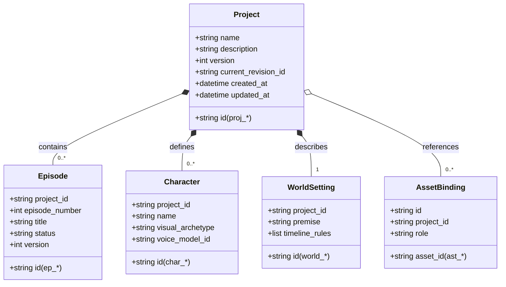
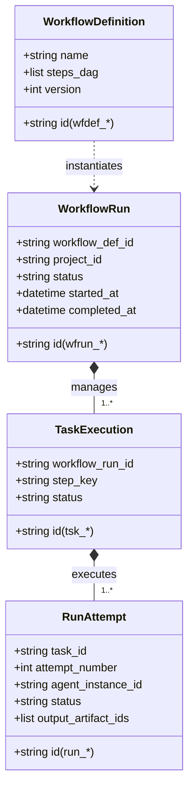
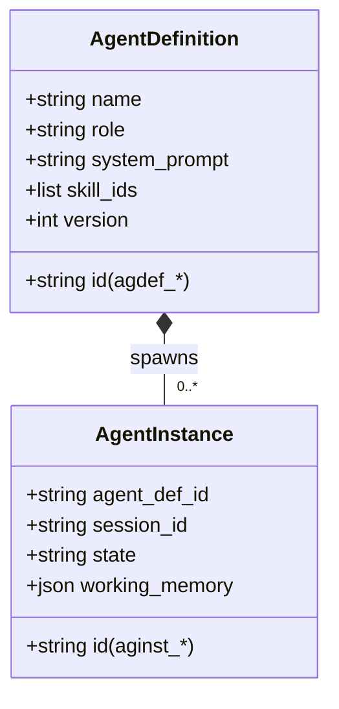

# Frontend V3 Aggregate Map & Entity Boundaries

This document defines the Domain Aggregate Roots, child entities, value objects, and relationship boundaries across the WindAgent system.

---

## 1. Primary Aggregate Root: `Project`

---

## 2. Orchestration Aggregate Root: `WorkflowRun`

---

## 3. Agent Aggregate Root: `AgentDefinition` & `AgentInstance`

---

## 4. Invariant Rules Across Boundaries

1. **Transactional Boundary**: Mutations to an `Episode`, `Character`, or `WorldSetting` increment the parent `Project.version` or the sub-aggregate version according to the concurrency contract.
2. **Artifact Immutability**: Once an `Artifact` is written by a `RunAttempt`, its content and checksum cannot be altered. Edits produce a new `Revision` or new `Artifact`.
3. **Asset Decoupling**: An `Asset` exists independently in the asset catalog (`/api/v3/assets`) and is linked to Projects via `AssetBinding`.
