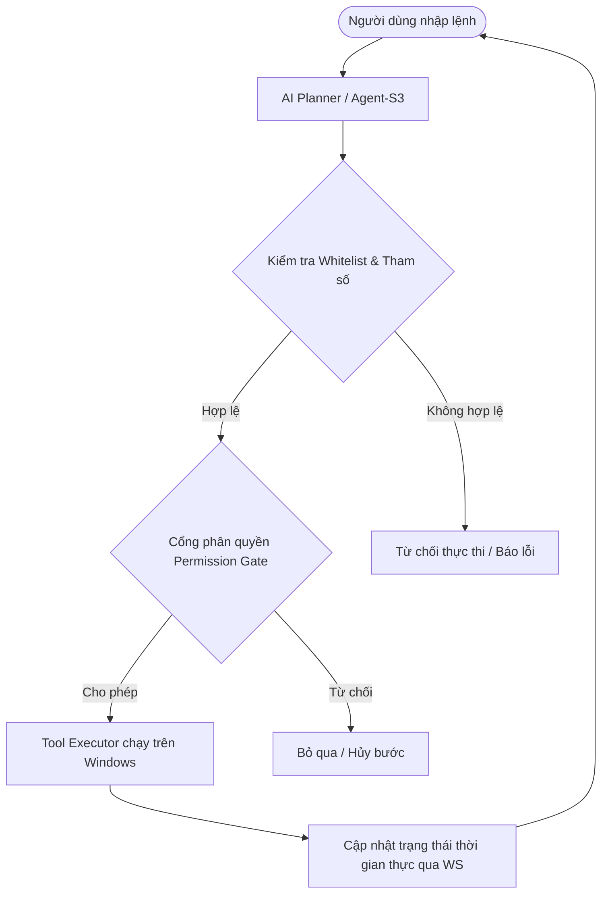

# WindAgent v1.2.0 — Tổng quan Scope & Kiến trúc Hệ thống

Tài liệu này định nghĩa chính thức phạm vi chức năng (Scope) và kiến trúc tổng quan của dự án **WindAgent** phiên bản v1.2.0. Đây là nguồn tham chiếu duy nhất dùng để đối chiếu hoạt động phát triển và kiểm thử hệ thống.

---

## 1. WindAgent là gì?

**WindAgent** là một nền tảng Desktop AI Agent dạng local-first dành cho hệ điều hành Windows. Hệ thống cho phép người dùng ra lệnh bằng ngôn ngữ tự nhiên để điều khiển máy tính, thực thi các quy trình tự động hóa (Workflows) trên môi trường desktop thực tế thông qua các mô hình AI chạy cục bộ.

### Vòng lặp Core Agent Loop

---

## 2. Các phân hệ chức năng chính (Phản ánh trên Frontend)

Giao diện WindAgent v1.2.0 được chia thành 10 phân hệ chức năng chính:

1. **Dashboard (Bảng điều khiển trung tâm)**
   - Theo dõi tài nguyên phần cứng hệ thống theo thời gian thực (CPU, RAM, GPU, VRAM).
   - Hiển thị thống kê: Số lượng Agent hoạt động, tác vụ đang chạy, tỷ lệ chạy thành công, tốc độ phản hồi.
   - Biểu đồ phân bổ lưu lượng cuộc gọi tới các mô hình AI và lịch sử hoạt động.
   - Timeline log hoạt động gần đây và hàng đợi tác vụ (Task Queue).

2. **Agent Workspace (Không gian làm việc)**
   - Khung chat tương tác với Agent.
   - Bảng log Terminal/Console ghi nhận các câu lệnh command line thực tế đang chạy.
   - Trình duyệt tích hợp (Simulated Browser Pane) hiển thị trang web đang thao tác.
   - Quản lý mục tiêu hiện tại (Current Goal) và thanh tiến trình tiến độ.
   - Thống kê các công cụ đang được sử dụng (Tools in Use) và mức tiêu thụ Token bộ nhớ.

3. **Agents Directory (Thư mục Agent)**
   - Quản lý và định cấu hình cho các Agent chuyên biệt:
     - **Planner**: Lập kế hoạch workflow tổng quát.
     - **Coder**: Phát triển, refactor và sửa lỗi mã nguồn.
     - **Researcher**: Tìm kiếm thông tin và cào dữ liệu web.
     - **GUI Agent**: Tương tác trực tiếp giao diện đồ họa.
     - **Browser Agent**: Tự động hóa trình duyệt web.
     - **Memory Agent**: Truy vấn và lưu trữ ngữ cảnh dài hạn.

4. **Router (Điều phối mô hình)**
   - Quản lý quy tắc định tuyến cuộc gọi AI (Routing Rules Library).
   - Bản đồ kết nối định tuyến (Routing Graph) giữa các vai trò Agent và các mô hình đích.
   - Cấu hình chuỗi dự phòng (Fallback Chains) khi mô hình chính gặp sự cố.
   - Trình mô phỏng định tuyến (Route Simulation Flowchart) ước tính chi phí, độ trễ và độ tin cậy.

5. **Workflows (Quy trình làm việc)**
   - Hiển thị danh sách các workflow đang chạy hoặc đã thực thi trong lịch sử.
   - Trạng thái trực quan của từng bước chạy (`pending`, `running`, `success`, `failed`, `skipped`, `cancelled`).

6. **Browser (Trình duyệt mô phỏng)**
   - Phân hệ giả lập/điều khiển trình duyệt chuyên sâu cho phép Agent thực hiện các thao tác click, điền form, và cuộn trang.

7. **Files (Quản lý tập tin)**
   - Giao diện quản lý thư mục và tệp tin cục bộ, cho phép Agent đọc/ghi dữ liệu trong môi trường sandbox được chỉ định.

8. **Memory (Quản lý bộ nhớ)**
   - Truy vấn cơ sở dữ liệu Vector lưu trữ ngữ cảnh dài hạn.
   - Bản đồ các điểm neo bộ nhớ (Memory Recall) giúp duy trì ngữ cảnh nhất quán qua các phiên làm việc.

9. **Models (Quản lý mô hình)**
   - Kết nối với Ollama cục bộ hoặc các dịch vụ đám mây (OpenAI, Anthropic, Mistral).
   - Hỗ trợ tải trực tiếp mô hình (ví dụ: `qwen3:4b-q4`) và kiểm tra trạng thái hoạt động (online/offline).

10. **Settings (Cài đặt hệ thống)**
    - Bật/tắt chế độ an toàn (Safe Mode).
    - Cấu hình Cổng phân quyền (Permission Gating) cho các tác vụ nhạy cảm.
    - Cài đặt danh sách từ khóa nhạy cảm cần cảnh báo và API key của các nhà cung cấp.

---

## 3. Kiến trúc kỹ thuật & Công nghệ sử dụng

Hệ thống được thiết kế theo mô hình local-first sidecar kiến trúc 2 lớp chính:

*   **Tauri Frontend (React + TypeScript + Vite)**:
    Giao diện người dùng cao cấp, tương tác mượt mà thông qua biểu đồ SVG tự dựng, kết nối song song qua REST API và WebSocket đến Sidecar Backend. Khi được đóng gói qua Tauri, frontend chạy trong Webview bảo mật và có thể gọi các API hệ thống của Rust.
*   **FastAPI Sidecar Backend (Python)**:
    Chịu trách nhiệm thực thi logic nghiệp vụ thực tế, chạy độc lập dưới dạng sidecar. Quản lý các dịch vụ:
    - **WorkflowRunner**: Chạy tuần tự các bước, hỗ trợ Pause/Resume/Stop/Retry thông qua máy trạng thái (State Machine).
    - **ToolExecutor**: Thực thi hành động trên Windows thông qua `PyAutoGUI` (hoặc mock cho môi trường CI).
    - **PermissionService**: Quản lý cấu hình bảo mật và treo luồng chờ phê duyệt từ giao diện khi gặp công cụ rủi ro trung bình/cao.
    - **Agent-S3 Adapter**: Tích hợp công cụ đề xuất hành động trực quan dựa trên ảnh chụp màn hình (Screen-grounded planning).
    - **Database (SQLite + SQLAlchemy)**: Lưu trữ bền vững dữ liệu phiên, tin nhắn, workflow và lịch sử sự kiện.

---

## 4. Danh sách Công cụ Hỗ trợ (Tool Whitelist)

Hệ thống chỉ cho phép thực thi các công cụ nằm trong whitelist cứng sau đây nhằm bảo đảm an toàn:

| Tên công cụ | Mức rủi ro | Cơ chế phê duyệt mặc định | Mô tả |
|---|---|---|---|
| `screenshot` | Safe | Thực thi ngay lập tức | Chụp ảnh màn hình hiện tại |
| `wait` | Safe | Thực thi ngay lập tức | Tạm dừng chạy trong N giây |
| `scroll` | Medium | Không yêu cầu phê duyệt | Cuộn chuột trên màn hình |
| `open_app` | Medium | Phê duyệt nếu bật Safe Mode | Mở ứng dụng trong whitelist giới hạn |
| `open_url` | Medium | Phê duyệt nếu bật Safe Mode | Mở URL trên trình duyệt mặc định |
| `hotkey` | Medium | Phê duyệt nếu bật Safe Mode | Gửi tổ hợp phím (ví dụ: `ctrl+c`) |
| `press_key` | Medium | Phê duyệt nếu bật Safe Mode | Bấm một phím đơn trên bàn phím |
| `type_text` | Medium | Phê duyệt nếu độ dài > 20 ký tự hoặc chứa từ nhạy cảm | Gõ chữ vào ứng dụng đang active |
| `click_xy` | High | Luôn yêu cầu phê duyệt (confirm_before_click) | Click vào tọa độ cụ thể (x, y) |
| `click_target` | High | Luôn yêu cầu phê duyệt trong Safe Mode | Thực hiện click theo grounding vision |
| `agent_s3_step` | High | Luôn yêu cầu phê duyệt trước khi gọi | Chạy một bước lập kế hoạch qua Agent-S3 |

---

## 5. Rủi ro kỹ thuật & Giải pháp giảm thiểu

| Rủi ro | Tác động | Giải pháp trong v1.2.0 |
|---|---|---|
| Mô hình Planner trả về JSON lỗi | Workflow không chạy được | Xác thực Schema + Cơ chế Repair prompt 1 lần + Báo lỗi chi tiết về UI. |
| Mất tiêu điểm (Focus) khi gõ phím | PyAutoGUI gõ sai cửa sổ | Hỗ trợ fallback copy dữ liệu vào Clipboard và gửi lệnh paste (`Ctrl+V`) cho ký tự đặc biệt/tiếng Việt. |
| Mất kết nối WebSocket | UI không cập nhật trạng thái | Cơ chế tự động kết nối lại (Auto-reconnect) kết hợp replay lịch sử sự kiện từ SQLite. |
| Treo luồng thực thi khi chờ quyền | Ứng dụng không phản hồi | Giới hạn thời gian chờ phê duyệt tối đa (mặc định 60 giây), tự động từ chối nếu hết giờ. |
| Tiết lộ mã API key qua API health | Rò rỉ thông tin nhạy cảm | Lớp lọc bí mật (Secret Scrubbing Layer) tự động chuyển đổi thông tin API Key thành trạng thái Boolean trong response. |

---

## 6. Liên kết Tài liệu liên quan

- [docs/api_contract.md](file:///d:/antigaravity_code/WindAgent/docs/api_contract.md) — Tài liệu đặc tả REST API.
- [docs/event_protocol.md](file:///d:/antigaravity_code/WindAgent/docs/event_protocol.md) — Tài liệu đặc tả WebSocket Event.
- [docs/safety_policy.md](file:///d:/antigaravity_code/WindAgent/docs/safety_policy.md) — Chính sách bảo mật chi tiết.
- [docs/agent_s3_integration.md](file:///d:/antigaravity_code/WindAgent/docs/agent_s3_integration.md) — Hướng dẫn cài đặt và cấu hình Agent-S3.