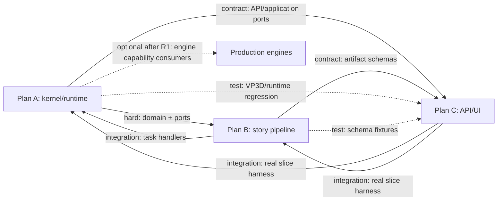

# PARALLEL_BOOTSTRAP_GATE and Contract Freeze

## Purpose and limit

`PARALLEL_BOOTSTRAP_GATE` is a short coordination gate, not a fourth execution plan. It freezes the minimum names, schemas, ownership, baseline evidence, and merge order needed for Plans A, B, and C to work concurrently. It creates no production implementation and must remain small enough to complete before branch fan-out.

The gate starts from baseline `9a09375700db02a64315068f008b15e43ba5f42d`. Existing user changes to `road_map.md` and `road_map_v2_implementation_plan.md` are not staged, reverted, copied, or absorbed into bootstrap commits.

## Required bootstrap participants and outputs

| Participant | Must approve | Output |
|---|---|---|
| Plan A owner | Domain IDs/states, task/event names, ports, persistence ownership, orchestration boundary | Contract version and compatibility rules |
| Plan B owner | Story artifact payloads, quality schemas, handler inputs/results, prompt provenance | Artifact and task contract fixture proposals |
| Plan C owner | HTTP resources/commands/errors, polling/event view, TypeScript generation surface | API/client/UI contract fixture proposals |
| Integration owner | File ownership, dependency edges, gate owners, merge train, evidence paths | Signed bootstrap checklist and merge calendar |

Normative planning documents:

- `00_CURRENT_CODEBASE_FINDINGS.md`
- this file
- `40_FILE_OWNERSHIP_MATRIX.md`
- `50_CROSS_PLAN_CONTRACTS.md`
- `PLAN_A_TO_PLAN_B_CONTRACT.md`
- `PLAN_A_TO_PLAN_C_CONTRACT.md`
- `PLAN_B_TO_PLAN_C_CONTRACT.md`

## Bootstrap checklist

All items are required before fan-out:

- [x] Confirm `HEAD` equals the baseline and capture `git status --short` without mutating the worktree.
- [x] Re-run or explicitly accept the recorded baseline failures; tag them `pre-existing` with owner and retirement gate.
- [x] Freeze contract version `studio.contract/v0.1` and artifact schema version `studio.artifact/v1alpha1`.
- [x] Freeze IDs, states, approval modes/checkpoints, task types, event types, error codes, and HTTP paths below.
- [x] Freeze owner and forbidden-file rules from the ownership matrix.
- [x] Create consumer contract fixtures before any branch invents an implementation-specific shape.
- [x] Assign one migration owner, one event-catalog owner, one lockfile owner, and one CI-workflow owner.
- [x] Agree that `OrchestratorService` is the sole new Story orchestration authority and that every long-running Story task uses durable submission/worker execution.
- [x] Agree that final certification fails closed on fake/mock/bypass/hardcoded execution.
- [x] Record unresolved external prerequisites for the real provider, database, worker, and Tauri environment.

## Frozen domain contract v0.1

### Identity and hierarchy

| Contract | Frozen meaning | Compatibility rule |
|---|---|---|
| `SeriesProjectId` | Canonical Studio series/project identifier | Existing `VideoProjectId` values remain readable; conversion is explicit and lossless during migration. No second project row is created. |
| `EpisodeId` | Creative Studio episode aggregate ID | Distinct from VP3D `EpisodeRunId`, `EpisodeSceneId`, and `EpisodeFixture`. |
| `ProductionRevisionId` | Immutable revision lineage ID | Reuse existing type and parent/hash semantics; add series/episode association through the canonical repository. |
| `ArtifactId` | Immutable content-addressed story artifact reference | Artifact content may be stored separately, but identity includes schema version and content hash. |
| `StudioRunId` | Orchestrator-owned DAG/run identity | Durable task IDs are children of a Studio run and never replace the aggregate ID. |

Canonical hierarchy is exactly `SeriesProject -> Episode -> ProductionRevision`. `VideoProject` remains a V2 compatibility facade/read path during deprecation; it is not a competing aggregate.

### Episode lifecycle

Frozen state values:

`DRAFT`, `IDEA_REVIEW`, `STORY_BIBLE_REVIEW`, `OUTLINE_REVIEW`, `SCREENPLAY_REVIEW`, `REVISING`, `LOCKED`, `READY_FOR_PRODUCTION`, `FAILED`, `CANCELLED`.

Rules:

1. `READY_FOR_PRODUCTION` is the single terminal success enum value for Roadmap 1.
2. The externally named milestone/event may qualify the aggregate as `studio.episode.ready_for_production`; no second state value is introduced.
3. Approval checkpoints are IDEA, STORY_BIBLE, OUTLINE, and SCREENPLAY.
4. Approval modes are `AUTO`, `HUMAN_REQUIRED`, and `QUALITY_GATE_ONLY`.
5. A successful screenplay lock transitions `SCREENPLAY_REVIEW -> LOCKED -> READY_FOR_PRODUCTION` atomically or through an idempotently resumable two-command sequence; implementation must document which.
6. Content mutation after lock always derives a new `ProductionRevision` with the locked revision as parent.

### Revision and approval invariants

`ProductionRevision` v0.1 must expose: revision ID, series ID, episode ID, optional parent revision ID, creator/actor, creation time, canonical content hash, state/status, lock state, invalidation intent, summary, metadata, and optimistic version.

`ApprovalPolicy` v0.1 must expose: policy ID/version, checkpoint-to-mode map, quality thresholds by checkpoint, maximum review/revision iterations, required approver roles when human review is enabled, and effective time. An `ApprovalDecision` is bound to aggregate ID, revision ID, artifact hash, checkpoint, actor, decision, reason, and timestamp. A stale hash or revision is rejected.

### Story artifact envelope

Every artifact uses an immutable envelope:

```text
artifact_id, artifact_type, schema_version,
series_id, episode_id, revision_id,
content_hash, input_artifact_refs[],
prompt_id, prompt_version, prompt_hash,
model_route_id, provider_id, model_id,
created_at, created_by, content
```

Frozen artifact types:

- `CreativeBrief`
- `IdeaCandidateSet` containing 3–5 `IdeaCandidate` records and score dimensions
- `SelectedIdea`
- `StoryBible`
- `WorldBible`
- `CharacterCanon`
- `BeatSheet`
- `EpisodeOutline`
- `ScreenplayDraft`
- `ReviewReport`
- `RevisionProposal`
- `LockedScreenplayReceipt`
- `LockedScreenplayPackage`

Plan B owns content schemas. Plan A owns envelope, identity, hash, repository, and lock invariants. Plan C consumes schemas and does not redefine them in TypeScript.

## Frozen durable task contract

Task type names:

- `studio.story.idea.generate`
- `studio.story.idea.evaluate`
- `studio.story.bible.generate`
- `studio.story.beats.generate`
- `studio.story.outline.generate`
- `studio.story.screenplay.generate`
- `studio.story.review`
- `studio.story.revise`
- `studio.story.lock`

Idea selection and human approval are synchronous/idempotent commands that unblock an orchestrator node; they are not hidden model tasks.

Minimum `StudioTaskEnvelope` fields:

```text
contract_version, task_type, task_id, studio_run_id, dag_node_id,
series_id, episode_id, revision_id,
input_artifact_refs[], input_hashes[],
approval_policy_id, approval_policy_version,
idempotency_key, correlation_id, causation_id,
attempt, deadline, requested_capabilities,
payload
```

Minimum `StudioTaskResult` fields:

```text
contract_version, task_id, studio_run_id, dag_node_id,
status, output_artifact_refs[], output_hashes[],
quality_summary, route_provenance, usage,
next_episode_state, emitted_event_refs[], error
```

Compatibility rule: the current `WorkSubmission`/queue fact shape remains accepted. Studio submissions add a discriminated versioned envelope in `parameters` or an additive typed field until the SQL migration is live. Claiming and finalization must preserve unknown fields across retries. The eventual adapter must not turn an arbitrary user prompt into a Story task without a frozen task type and aggregate context.

## Frozen event contract

Event names use lower-case dot notation at the Studio boundary:

- `studio.series.created`
- `studio.episode.created`
- `studio.revision.derived`
- `studio.artifact.created`
- `studio.idea.candidates_generated`
- `studio.idea.selected`
- `studio.approval.requested`
- `studio.approval.recorded`
- `studio.story.review_completed`
- `studio.story.revision_requested`
- `studio.screenplay.locked`
- `studio.episode.ready_for_production`
- `studio.run.failed`
- `studio.run.cancelled`

Each event carries `event_id`, `event_type`, `schema_version`, `aggregate_id`, `aggregate_type`, `sequence`, `occurred_at`, `correlation_id`, `causation_id`, `studio_run_id`, revision/artifact refs as applicable, and a redaction-safe payload. Plan A alone edits the canonical event catalog. Task finalization publishes through the transactional outbox; consumer read models must be idempotent by event ID and sequence.

## Frozen port and authority contract

Plan A provides provider-neutral ports for:

- `SeriesProjectRepositoryPort`
- `EpisodeRepositoryPort`
- `ProductionRevisionRepositoryPort` (extended compatible surface)
- `StoryArtifactRepositoryPort`
- `ApprovalRepositoryPort`
- `StudioUnitOfWorkPort`
- `StudioRunOrchestratorPort`
- `StudioTaskSubmissionPort`
- `StudioRunQueryPort`
- `StudioEventQueryPort`
- `RuntimeCapabilityPort`
- `PreproductionModelPort` production adapter boundary

Authority rules:

1. API application services call `StudioRunOrchestratorPort`; they do not construct a DAG or submit individual model tasks directly.
2. `OrchestratorService` creates/advances the Story DAG and uses `StudioTaskSubmissionPort` for durable nodes.
3. Worker runtime handlers execute one frozen task type, persist artifacts through ports/UoW, and return `StudioTaskResult`.
4. Durable completion is reconciled back into the orchestrator before the next dependent node becomes runnable.
5. `WorkflowEngine` and `ProductionWorkflowEngine` receive no new Story imports, task types, states, or routes.

## Frozen API contract surface

Base path: `/api/v3/studio`.

| Resource/command | Method/path | Contract intent |
|---|---|---|
| Series collection | `POST /series`, `GET /series` | Create/list without sample IDs. |
| Series detail | `GET /series/{series_id}` | Canonical aggregate plus links. |
| Episodes | `POST /series/{series_id}/episodes`, `GET /series/{series_id}/episodes` | Create/list creative episodes. |
| Episode detail | `GET /episodes/{episode_id}` | State, current revision, approvals, artifact summary, run link. |
| Start/continue Story run | `POST /episodes/{episode_id}/runs` | Idempotently ask the orchestrator to start or resume; returns `202` and run resource. |
| Run status | `GET /runs/{run_id}` | DAG/task progress, wait reason, retryability, latest event cursor. |
| Run events | `GET /runs/{run_id}/events?after=` | Pollable canonical event stream/read model; transport may later add SSE without changing event shape. |
| Idea decision | `POST /episodes/{episode_id}/idea-selection` | Bind selected candidate to revision/hash/idempotency key. |
| Approval decision | `POST /episodes/{episode_id}/approvals` | Bind decision to checkpoint/revision/artifact hash. |
| Artifacts | `GET /episodes/{episode_id}/artifacts`, `GET /artifacts/{artifact_id}` | Versioned typed artifact views. |
| Revision derivation | `POST /episodes/{episode_id}/revisions` | Derive from a locked or current revision; never mutate locked content. |
| Screenplay lock | `POST /episodes/{episode_id}/screenplay-lock` | Idempotent lock command; returns receipt or conflict. |

Canonical errors: `NOT_FOUND` (404), `VALIDATION_ERROR` (422), `STALE_REVISION` (409), `ARTIFACT_HASH_MISMATCH` (409), `LOCKED_REVISION` (409), `IDEMPOTENCY_MISMATCH` (409), `INVALID_TRANSITION` (409), `APPROVAL_REQUIRED` (409 for a disallowed command; normal waiting is represented in the run resource), `CAPABILITY_UNAVAILABLE` (503), `PROVIDER_UNAVAILABLE` (503), and `INTERNAL_ERROR` (500 with redacted detail).

All mutating endpoints require an idempotency key and expected revision/version where applicable. A repeated key with the same normalized request returns the original result; a different request returns `IDEMPOTENCY_MISMATCH`.

## Dependency graph after freeze



Dependency types:

- **hard:** code cannot compile or persist correctly without the upstream item.
- **contract:** work may proceed against a frozen fixture/interface before implementation lands.
- **integration:** branches can work independently but must meet at the named gate.
- **test:** one plan supplies fixtures/checkers or regression obligations consumed by another.
- **optional:** useful future extension and explicitly excluded from Roadmap 1 acceptance.

## What remains unimplemented after bootstrap

All production work remains in exactly three plans: migrations/repositories/orchestration/worker/provider adapter in A; Story schemas/services/prompts/review/lock handlers in B; API/client/state/UI/certification harness in C. Bootstrap only makes concurrent execution safe.

## Gate pass evidence

`PARALLEL_BOOTSTRAP_GATE` passes when a single coordination commit contains the normative documents/fixtures, all three plan owners acknowledge them, no contract question is still marked `NEEDS_DECISION`, baseline failures have owners, and `git diff --check` is clean. Only then create the three execution branches described in `70_INTEGRATION_AND_MERGE_STRATEGY.md`.
