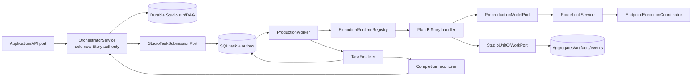

# Plan A — Studio Kernel & Runtime Foundation (S0–S3)

## Plan charter

### Purpose

Establish one provider-neutral Studio domain, one durable execution path, one evidence authority, and one orchestration authority on which Plans B and C can safely build. Plan A converts the current useful but split foundations into the canonical `SeriesProject -> Episode -> ProductionRevision` kernel and `OrchestratorService -> durable queue -> worker -> finalizer -> orchestrator reconciliation` path.

### Scope

- S0 truth/evidence controls and retirement of stale PASS claims.
- S1 architecture boundary repair, duplicate-authority fences, event/task taxonomy.
- S2 Studio aggregates, lifecycle, approvals, revision locking/derivation, ports, and persistence migration.
- S3 orchestration/durable task integration, worker/provider adapter, capability discovery, recovery, and foundation gates.
- Compatibility for V2 `VideoProject`/screenplay APIs and VP3D production behavior.

### Non-goals

- Story prompts, artifact content schemas, candidate scoring, screenplay/review algorithms — Plan B.
- FastAPI V3 routers, generated TypeScript, desktop screens, and final product certification harness — Plan C.
- Unreal implementation, Blender/VP3D redesign, renderer cutover, asset generation, animation, or final video.
- A new `StoryWorkflowEngine`, a replacement database, or deletion of V2/legacy production code.

### Current code evidence

- **OBSERVED:** current `VideoProject`/`ProductionRevision` and SQL repositories are reusable but lack the full Studio relationship/provenance shape.
- **OBSERVED:** core application services import concrete storage; the architecture checker currently fails with 13 violations.
- **OBSERVED:** `OrchestratorService` owns the multi-agent DAG but dispatches directly; the real durable worker path starts at `SqlWorkSubmissionAdapter` and is not reconciled to that DAG.
- **OBSERVED:** worker leases, fencing, heartbeat, runtime dispatch, CAS finalization, and outbox are real and tested.
- **OBSERVED:** `WorkSubmission` is generic and cannot express Studio aggregate/task/artifact provenance without a versioned extension.
- **OBSERVED:** route locking and endpoint coordination exist, but no production `PreproductionModelPort` adapter was found.
- **OBSERVED:** `ProductionEnginePort` and Blender adapter are real; `RuntimeCapabilityProfile` and Unreal adapter are absent.

### Target architecture

No API or story handler advances the DAG directly. No legacy engine receives a new Story dependency.

## Ownership and dependencies

### Owned modules and expected files

Plan A is the only plan allowed to create or materially edit:

- `core/windagent_core/domain/studio/**` — new canonical aggregates/value objects.
- `core/windagent_core/contracts/studio/**` — IDs, commands/results, task/event envelopes, ports, errors, capabilities.
- narrowly scoped compatibility edits in `core/windagent_core/domain/video_production/project.py`, ID exports, and package `__init__.py` files.
- `orchestration/windagent_orchestration/studio/**` — run planning/advancement, durable dispatch, completion reconciliation, deprecation guards.
- narrow changes to `orchestrator_service.py` and durable scheduler/registry contracts.
- `storage/windagent_storage/studio/**`, compatible video-production repositories/ORM, UoW, outbox, queue submission/claim/finalization adapters.
- the single ordered migration under `storage/windagent_storage/migrations/alembic/versions/**` and its migration/preflight registration.
- `providers/**` or an infrastructure adapter package only where needed to compose the real story model port; provider-neutral core remains clean.
- `apps/worker/windagent_worker/**` for handler registration, capability discovery, and fail-closed fake guards.
- canonical event catalog and architecture/evidence checkers.
- Plan A unit/contract/integration tests under existing matching test trees.

Expected additions should be narrow, for example `contracts/studio/models.py`, `contracts/studio/ports.py`, `domain/studio/series.py`, `domain/studio/episode.py`, `orchestration/.../studio/service.py`, `.../studio/completion_reconciler.py`, and `storage/.../studio/repositories.py`. Exact names may change during bootstrap, but ownership may not.

### Forbidden files/areas

- `intelligence/windagent_intelligence/**/story/**`, prompts, scoring, screenplay/review implementations — Plan B.
- `apps/api/**/routers/v3/**`, `frontend/**`, `apps/desktop/**`, root frontend lockfiles — Plan C.
- broad edits to VP3D episode/director/render implementations or Blender adapter internals.
- deletion or semantic rewrite of V2 routers.
- `.github/workflows/ci.yaml` after Plan C takes final integration ownership; Plan A supplies check scripts and evidence schema, not competing workflow edits.

### Inputs

- Frozen contracts in `01_PARALLEL_BOOTSTRAP_AND_CONTRACT_FREEZE.md`.
- Plan B artifact schemas/handler registrations via `PLAN_A_TO_PLAN_B_CONTRACT.md`.
- Plan C application-facing consumer tests via `PLAN_A_TO_PLAN_C_CONTRACT.md`.

### Outputs

- Compilable provider-neutral Studio contracts and application ports.
- Additive, reversible persistence migration and compatibility repository behavior.
- Durable Story task submission/execution/completion path owned by the canonical orchestrator.
- Real provider adapter and typed capability status, without mock fallback in certification mode.
- Fresh, reproducible foundation evidence and regression gates.

## Detailed phases

### A0 — Accept bootstrap and pin current truth

| Required item | Execution detail |
|---|---|
| Objective | Turn the planning freeze into executable contract fixtures and a current evidence manifest before production edits. |
| Inspection | Reconfirm SHA/worktree, architecture graph, current checker outputs, package dependency declarations, migration head, task/outbox/worker schemas, provider composition, and VP3D smoke surfaces. |
| Steps | 1. Add machine-readable contract fixtures for IDs/states/tasks/events/errors without implementation. 2. Record command, SHA, tool versions, timestamps, exit status, and artifact checksum in a small committed manifest schema. 3. Label all baseline failures `pre-existing` with retirement phase. 4. Add a checker ensuring no Story import enters `WorkflowEngine` or `ProductionWorkflowEngine`. |
| Migration | None. Do not regenerate historical evidence or copy historic PASS reports forward. |
| Compatibility | Existing tests/commands run unchanged; fixture consumers are additive. |
| Tests | Contract fixture validation, `git diff --check`, existing architecture/event/duplicate-model/video-workspace checkers, targeted worker/orchestration tests. |
| Evidence | `artifacts/...` raw logs in CI artifact storage; committed manifest contains only deterministic metadata/checksums and baseline classifications. |
| Gate | `CONTRACT_FREEZE_GATE`: all fixtures match v0.1 docs, no unresolved naming decision, ownership acknowledged. |
| Rollback | Revert the isolated bootstrap fixture/checker commit; no schema or runtime state changed. |

Parallelism inside A0: one task validates domain/task fixtures while another records checker/test baselines; only the Plan A owner edits the manifest and catalog files.

### A1 — Repair boundaries and fence duplicate authorities

| Required item | Execution detail |
|---|---|
| Objective | Make the package graph safe for new Studio code and ensure one new Story orchestration authority. |
| Inspection | Trace the four core-to-storage imports, undeclared dependencies/cycles, composition of `WorkflowEngine`, composition/callers of `ProductionWorkflowEngine`, `OrchestratorService` inbound/outbound paths, and current no-legacy checker coverage. |
| Steps | 1. Move application handlers/query services outward or invert them behind core ports in small behavior-preserving commits. 2. Declare/remove package dependencies until the live checker is green. 3. Add deprecation markers and import/runtime guards: legacy engines may serve existing paths but reject new `studio.story.*` registration. 4. Document ownership and emit diagnostics when a deprecated engine is composed. 5. Keep `OrchestratorService` public behavior stable while adding an extension seam for Studio run commands. |
| Migration | Use compatibility re-exports for moved handlers; deprecate imports before removal. Do not mass-move modules. |
| Compatibility | V2 API and VP3D tests must remain green. Existing production workflow environment flag retains behavior. |
| Tests | Architecture import checker becomes green; dependency/cycle tests; no-new-Story-legacy-engine tests; existing OrchestratorService, V2, worker, VP3D suites. |
| Evidence | Graph query results before/after, checker JSON/log, deprecation inventory, targeted test reports. |
| Gate | `STUDIO_ARCHITECTURE_GATE`: zero live architecture violations and no Story dependency/call edge to either legacy engine. |
| Rollback | Revert each import-inversion slice independently; compatibility exports keep callers operational. |

Parallelism inside A1: package-boundary repair and legacy-authority characterization can proceed concurrently if neither edits `orchestrator_service.py` or composition. The Plan A owner serializes those hotspots.

### A2 — Implement canonical Studio domain and compatibility model

| Required item | Execution detail |
|---|---|
| Objective | Provide canonical immutable aggregates, lifecycle rules, approvals, revision lineage, errors, and ports. |
| Inspection | Re-read `VideoProject`, `ProductionRevision`, revision service, approval primitives, VP3D episode identifiers, V2 command/read models, event catalog, and duplicate-model checker. |
| Steps | 1. Add `SeriesProject`, creative `Episode`, lifecycle enum, `ApprovalPolicy`, checkpoint types, artifact envelope/reference, typed errors, commands/results, and runtime capability profile. 2. Extend revision service with series/episode association, canonical hash, stale-write protection, and locked-revision derivation. 3. Define repository/UoW/orchestrator/task/event/capability/model ports. 4. Add compatibility conversion between `VideoProject` and `SeriesProject` without duplicate ownership. 5. Register Studio event types through the one catalog owner. |
| Migration | Start with additive types and facades; leave old serialized fields readable. Introduce schema/version discriminators. Deprecate ambiguous names but do not remove them in Roadmap 1. |
| Compatibility | Old `VideoProjectId` values and V2 reads remain valid; VP3D `EpisodeFixture` and IDs are unchanged. Unknown future artifact fields follow frozen versioning rules. |
| Tests | Aggregate invariants, state-transition table, approval modes/checkpoints, stale hash/version, lock immutability, derive-after-lock, serialization round trips, V2 compatibility, duplicate-model/event-taxonomy checks. Use property tests for transition/hash/idempotency invariants. |
| Evidence | Contract test report, event catalog snapshot, model ownership map, mutation/coverage results for critical invariants. |
| Gate | `STUDIO_DOMAIN_INTEGRATION_GATE`: A publishes tagged v0.1 domain/ports and B/C consumer fixtures compile. |
| Rollback | Remove additive types/exports if no persistence migration has landed; after migration, disable new writes and retain read adapters rather than dropping data. |

Parallelism inside A2: pure domain value objects, port protocols, and contract tests may proceed concurrently; one owner integrates IDs/exports and one owner alone edits the event catalog.

### A3 — Additive persistence, repositories, UoW, and outbox

| Required item | Execution detail |
|---|---|
| Objective | Persist Studio hierarchy, artifacts, approvals, lineage, runs, and events without a parallel database or unsafe cutover. |
| Inspection | Inventory current project/revision ORM columns, table constraints/indexes, repository/UoW transaction boundaries, idempotency records, outbox ordering, migration runner/head, backup/preflight/rehearsal tools, and production data assumptions. |
| Steps | 1. Write one ordered additive migration: required series/episode relations and Studio tables/columns/indexes. 2. Backfill existing projects/revisions deterministically with compatibility metadata; never invent story content. 3. Implement repositories and Studio UoW behind A2 ports. 4. Enforce unique artifact hash/version and approval/revision bindings. 5. Extend outbox schema use for Studio events with per-aggregate ordering. 6. Add dual-read compatibility first; enable canonical writes behind a reversible flag only after validation. |
| Migration | Expand -> backfill -> validate -> switch writes -> retain compatibility reads. No destructive column/table drop in Roadmap 1. Preflight includes backup, row counts, null/duplicate checks, and rollback rehearsal. |
| Compatibility | V2 repositories read migrated rows; new Studio data has a defined V2 projection or explicit unsupported fields without breaking existing endpoints. SQLite/test and production database behavior are both characterized. |
| Tests | Migration upgrade/rehearsal, pre/post row-count/hash checks, repository contracts, optimistic concurrency, transaction rollback, outbox ordering/idempotency, concurrent approval/lock tests. |
| Evidence | Migration checksum, preflight/postflight reports, rollback rehearsal log, schema snapshot, repository contract report. |
| Gate | `STUDIO_PERSISTENCE_GATE`: clean database + representative legacy fixture upgrade successfully; downgrade/restore procedure verified; B artifact repository fixtures pass. |
| Rollback | Turn off canonical writes, restore backup or execute the rehearsed additive downgrade where safe; keep compatibility columns until release retirement. |

Parallelism inside A3: repository adapters and migration test fixtures can run concurrently. Only the migration owner edits version scripts/registry; repository merge waits for the schema contract commit.

### A4 — Converge OrchestratorService with durable submission

| Required item | Execution detail |
|---|---|
| Objective | Make `OrchestratorService` the authority that plans and advances Studio Story DAGs while all long work runs durably. |
| Inspection | Trace goal submission, plan persistence, durable scheduler claims, direct runtime dispatch, `WorkSubmission`, SQL submission facts/outbox, task/workflow run relationships, cancellation, retry, and idempotency. |
| Steps | 1. Add Studio run commands/query model and deterministic DAG builder over frozen task types/checkpoints. 2. Persist DAG/run/node state before submission. 3. Add a versioned `StudioTaskSubmissionPort` adapter that wraps current `WorkSubmission` compatibly. 4. Mark a node dispatched only with a committed durable task identity. 5. Add completion reconciler consuming durable final state/event, comparing run/node/task/version, and making dependent nodes runnable. 6. Represent approval waits as durable run state; approval commands resume through the orchestrator. 7. Make cancellation/retry idempotent and correlation complete. |
| Migration | Introduce Studio path behind a feature flag and leave non-Studio direct dispatch unchanged. Later removal of direct dispatch is outside this plan unless tests prove it unused. |
| Compatibility | Current multi-agent conversation endpoints and worker task consumers continue to operate. Existing generic task fields survive; Studio fields are discriminated/versioned. |
| Tests | DAG determinism, dependency ordering, submit transaction failure, duplicate submission, restart/reconcile, approval pause/resume, cancellation, retry budget, stale completion, out-of-order/duplicate events. |
| Evidence | Persisted DAG/task correlation dump, failure-injection logs, state-machine transition coverage, no-legacy-engine graph assertion. |
| Gate | `DURABLE_ORCHESTRATION_GATE`: API-level application command produces queued durable nodes, worker completion advances only through reconciliation, restart resumes correctly. |
| Rollback | Disable Studio run feature flag; preserve persisted runs/tasks for diagnosis and resume after fix. Never rewrite terminal history. |

Parallelism inside A4: DAG/application service and submission-adapter work can proceed against fixtures; completion reconciliation begins after task/result serialization is frozen. `orchestrator_service.py` has one integrator.

### A5 — Worker Story runtime, atomic finalization, and recovery

| Required item | Execution detail |
|---|---|
| Objective | Execute frozen Story task types in an independent worker with leases/fencing and exactly-once observable effects. |
| Inspection | Worker composition/poll loop, heartbeat and lease takeover, runtime registry, execution request/result, finalizer CAS/outbox transaction, fake-runtime flags, shutdown/cancellation, artifact persistence boundary. |
| Steps | 1. Add a Studio runtime adapter/handler registry; Plan B supplies handlers, A supplies execution context/UoW. 2. Decode/validate task envelope before side effects. 3. Pass fencing/idempotency context into artifact persistence. 4. Extend finalization/reconciliation metadata without breaking generic tasks. 5. Make crash windows observable and recoverable: before provider, after provider, after artifact write, before/after finalizer commit. 6. Reject fake runtime and unregistered task types in certification mode. 7. Emit redaction-safe metrics/events for queue wait, execution, retry, and finalization. |
| Migration | Register Story capability additively. Keep generic tool/browser/local/subprocess runtime mappings. Do not replace the worker process or queue. |
| Compatibility | Existing worker and transactional-finalization tests remain green; legacy tasks decode through their current path. |
| Tests | Registry uniqueness, envelope validation, lease expiry/takeover, stale fencing rejection, heartbeat, duplicate delivery, crash matrix, cancellation, artifact/result/outbox atomicity, worker restart. Include Plan B contract handlers and controlled provider stub only in non-certification tests. |
| Evidence | Failure-injection matrix, task/artifact/outbox correlation, worker metrics snapshot, tests proving fake guard and stale worker rejection. |
| Gate | `STORY_WORKER_GATE`: at least one B handler crosses real SQL queue/independent worker/UoW/finalizer/reconciler with restart and duplicate-delivery tests. |
| Rollback | Unregister Story runtime and stop new submissions; existing tasks remain durable and can be retried after compatible deployment. |

Parallelism inside A5: registry/envelope work and failure-injection harness can proceed concurrently; finalizer changes are serialized and must land as a separate reviewable commit.

### A6 — Real provider adapter and runtime capability discovery

| Required item | Execution detail |
|---|---|
| Objective | Give Story handlers a real provider-neutral model port and expose typed runtime readiness without embedding provider choices in domain code. |
| Inspection | Route lock, endpoint coordinator, adapters, auth/config, usage/provenance, retry/error mapping, emergency mock routes, worker environment flags, Blender registration/env discovery. |
| Steps | 1. Implement infrastructure adapter from `PreproductionModelPort` to route lock/coordinator. 2. Lock route/model for a task attempt and return prompt/model/provider/usage provenance. 3. Map transient, schema, safety, quota, auth, and terminal failures into typed retryability. 4. Add `RuntimeCapabilityProfile` reporting durable DB, real model route, worker, Blender, and future engine capabilities with source/reason/timestamp. 5. Treat existing env variables as compatibility inputs, not hidden domain policy. 6. Add certification profile that fails if fake runtime/mock fallback/bypass is active. |
| Migration | Compose adapter behind the new port without changing current provider consumers. Gradually retire any specialized bridge only after its callers migrate; no forced Roadmap 1 deletion. |
| Compatibility | Existing provider adapter and VP3D/Blender behavior remain unchanged. Capability fields are additive and versioned. |
| Tests | Route-lock determinism, failover policy, auth/quota/error mapping, provenance completeness/redaction, capability profiles with/without dependencies, fake/mock rejection, controlled real-provider smoke tagged and opt-in. |
| Evidence | Redacted route receipt, capability report, provider smoke report, dependency versions; never credentials or raw sensitive prompts. |
| Gate | `REAL_MODEL_RUNTIME_GATE`: a worker Story handler invokes a configured real provider through the canonical coordinator and persists provenance; fail-closed scenarios are demonstrated. |
| Rollback | Disable real Story capability and leave runs in retryable/capability-unavailable state; do not silently fall back. |

Parallelism inside A6: capability discovery and provider-adapter error mapping can proceed concurrently; shared provider composition has one integrator.

### A7 — Foundation regression and handoff

| Required item | Execution detail |
|---|---|
| Objective | Prove A is a stable platform for B/C integration and has not damaged V2 or VP3D. |
| Inspection | Review every A-owned diff, schema compatibility, public exports, runtime feature flags, docs, evidence freshness, open baseline failures, and consumer contract status. |
| Steps | 1. Run full relevant Python tests and all architecture/taxonomy/version/duplicate/workspace checks. 2. Run migration and recovery rehearsal. 3. Run V2 API and VP3D/Blender contract tests. 4. Run A→B and A→C consumer suites. 5. Publish a versioned handoff manifest with contract versions, migration head, event/task registries, known limitations, and rollback commands. |
| Migration | No new migration in the handoff phase; late schema changes return to A3 and re-open gates. |
| Compatibility | Zero unclassified baseline regression. Any accepted pre-existing failure has owner and final retirement gate. |
| Tests | Full A package matrix plus cross-plan contract and smoke suites; controlled real model test only where credentials are available. |
| Evidence | Fresh CI run IDs, checksums, junit/coverage, migration/recovery reports, capability profile, contract manifests. |
| Gate | `PLAN_A_HANDOFF_GATE`: A domain/persistence/orchestration/worker/provider/capability outputs satisfy both consumer contracts. |
| Rollback | Revert the latest isolated phase or disable Studio flags; database uses rehearsed expand/migrate recovery. |

## Parallel and sequential execution within Plan A

Hard sequence: `A0 -> A1 -> A2 -> A3 -> A4 -> A5 -> A7`. A6 may start after A2 ports freeze and proceed alongside A3/A4; it must finish before A7 and before the real slice. Consumer-facing fixtures from A2 let B/C work before A3–A6 are complete.

Safe parallel lanes:

- Domain value objects/ports vs. compatibility tests in A2.
- Repository contracts vs. migration fixtures in A3.
- DAG/app service vs. submission adapter in A4.
- Capability discovery vs. provider adapter in A6.
- Failure injection vs. non-hotspot worker registry additions in A5.

Serialized hotspots: package exports, event catalog, migration head/registry, `orchestrator_service.py`, API/worker composition, queue/finalizer transaction code, and CI workflow.

## Plan-specific risks and conflict points

| Risk | Signal | Mitigation/owner | Rollback trigger |
|---|---|---|---|
| Two orchestration authorities survive under new names | Story import/task registration in a legacy engine | A architecture checker + graph assertion | Any Story run can advance outside OrchestratorService |
| Queue compatibility loses fields or identity | Retry result lacks run/node/hash | Versioned envelope round trip and old-task fixtures | Existing task cannot decode or Studio correlation breaks |
| Migration duplicates project/revision data | Row/hash mismatch after backfill | One migration owner, pre/post checks, no new project store | Any irreversible mismatch |
| Stale worker writes canonical artifacts | Artifact written with expired fence | Fence in UoW/idempotency condition, crash tests | Failure-injection test reproduces write |
| Provider fallback fakes success | Provenance says mock/unknown or guard absent | Certification profile fails closed | Any real gate can pass with fake flags |
| Architecture repair expands into product rewrite | Large unrelated moves | Small compatibility commits, diff budget, owner review | V2/VP3D regression or broad import churn |
| A and C collide in API composition | Both edit `composition.py` | A exposes narrow providers first; C integrates later | Unreviewable mixed composition conflict |

## Acceptance criteria

Plan A is accepted only when:

- All live architecture violations are fixed and duplicate Story-authority checks pass.
- Canonical Studio aggregates/ports and compatibility behavior satisfy v0.1 contracts.
- Migration upgrade/backfill/rehearsal and repository/UoW/outbox tests pass.
- A Studio run is planned by `OrchestratorService`, submitted durably, executed by an independent worker, atomically finalized, and reconciled after restart.
- Approval wait/resume, retry, cancellation, duplicate delivery, stale fence, and crash windows have passing tests.
- A real model reaches a Story handler through route lock/coordinator with complete redacted provenance; certification fails if fake/mock paths are enabled.
- V2, worker, provider, event taxonomy, duplicate models, video workspace, and VP3D regression gates have no unclassified regression.
- A→B and A→C contracts are published with fresh evidence and no unresolved breaking change.

## Plan A final verdict target

Do not claim this verdict from planning alone. The implementation branch may report `WIND_STUDIO_PLAN_A_FOUNDATION_READY` only after `PLAN_A_HANDOFF_GATE` passes with fresh evidence. Otherwise it reports the first failed gate and remains blocked from final integration.
