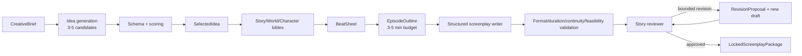

# Plan B — Story Intelligence & Screenplay Pipeline (S4–S10)

## Plan charter

### Purpose

Turn the existing orphaned preproduction capabilities into a provider-neutral, structured, reviewable Story pipeline that produces an immutable `LockedScreenplayPackage` for a 3–5 minute episode. Plan B owns creative artifact content, prompts, validation, scoring, review, and bounded revision behavior; it consumes Plan A’s aggregate/runtime contracts and supplies typed artifacts to Plan C.

### Scope

- S4 creative brief normalization and generation of 3–5 idea candidates.
- S5 deterministic evaluation, comparison, selection, and selected-idea lock.
- S6 Story Bible, World Bible, and Character Canon generation/validation.
- S7 Beat Sheet and Episode Outline with target-duration planning.
- S8 structured screenplay generation, formatting, duration, continuity, and production-feasibility validation.
- S9 review reports, revision proposals/diffs, bounded automated/human review loops.
- S10 approval-checkpoint behavior, screenplay lock request, receipt/package assembly, and handler integration with Plan A.

### Non-goals

- Aggregate storage, SQL migrations, durable queue, worker leases/fencing, orchestration authority, provider routing, or capability discovery — Plan A.
- HTTP routes, TypeScript contracts, UI state/screens, Tauri integration, or final evidence orchestration — Plan C.
- Asset/image/audio/video generation, scene direction, renderer-specific IR, Blender/Unreal execution, or final video.
- Training/fine-tuning a model, provider-specific prompts in domain code, unbounded self-revision, or hidden chain-of-thought capture.

### Current code evidence

- **OBSERVED:** core already defines useful immutable `CreativeBrief`, `StoryConcept`, `DialogueLine`, and `Screenplay` models.
- **OBSERVED:** intelligence already has brief expansion, outlining, screenplay writing, narration, entity extraction, style design, continuation, assembly, director/revision/duration utilities.
- **OBSERVED:** the story chain has no complete production application caller; reuse must be explicit rather than assumed.
- **OBSERVED:** brief/outliner parse JSON through `PreproductionModelPort`; screenplay writer asks for text and parses tolerantly, which is insufficient for the frozen structured contract.
- **OBSERVED:** prompts carry version/hash concepts but are inline; no centralized Story prompt catalog exists.
- **OBSERVED:** current reviewers primarily assess media candidates, not story logic, screenplay formatting, duration, continuity, or age suitability.
- **OBSERVED:** required bibles/canon/creative outline/review/receipt artifacts do not exist as canonical models.

### Target architecture

Each box is a pure application/domain service behind a frozen Plan A task handler. Provider calls cross only `PreproductionModelPort`; artifacts cross only the immutable Plan A envelope.

## Ownership and dependencies

### Owned modules and expected files

Plan B is the only plan allowed to create or materially edit:

- `core/windagent_core/domain/story/**` — provider-neutral artifact content models, score/review/finding/diff types, content validators.
- `intelligence/windagent_intelligence/story/**` — pipeline services, prompt catalog, structured response schemas/parsers/repair, scoring, continuity, duration, feasibility, review/revision, task handlers.
- narrowly scoped compatibility adapters/re-exports in existing `core/.../video_production/screenplay.py` and `intelligence/.../video/**`; no bulk move.
- Story-specific unit/property/golden/contract tests and fixtures.
- documentation of prompt/schema versions and evaluation rubrics.

Expected subpackages include `story/ideation`, `story/bibles`, `story/outline`, `story/screenplay`, `story/review`, `story/prompts`, and `story/runtime_handlers`. Exact names follow bootstrap conventions.

### Forbidden files/areas

- Plan A aggregate envelope/IDs/lifecycle/ports, storage/ORM/migrations/UoW/outbox, orchestrator/queue/worker/provider composition, canonical event catalog.
- Plan C API routers/models, frontend packages, desktop app, lockfiles, and CI workflow.
- `WorkflowEngine`, `ProductionWorkflowEngine`, new schedulers, or direct queue/repository/provider adapter imports.
- VP3D episode/director/IR/render engine code except read-only study and regression fixtures.

### Inputs

- A’s v0.1 aggregate, artifact envelope, task/result, approval, model-port, revision, error, and runtime-handler contracts.
- C’s presentation/fixture feedback through `PLAN_B_TO_PLAN_C_CONTRACT.md`.
- Creative brief for the final slice: Vietnamese rabbit/kite story, audience 5–8, target duration 3–5 minutes.

### Outputs

- Versioned Story artifact schemas and golden fixtures.
- Nine registered task handlers matching frozen task types.
- Structured prompts/responses with provenance and bounded repair.
- Deterministic quality/review/continuity/duration/feasibility outcomes.
- Revision proposals/diffs and a lock-ready screenplay package.

## Cross-cutting content rules

1. Every generated artifact validates before persistence; invalid output is a typed failure, never silently accepted text.
2. Model output is untrusted input. JSON/schema parsing, length limits, Unicode handling, instruction-injection isolation, and redaction occur before domain construction.
3. Prompt identity/version/hash and model-route provenance are recorded, but private reasoning and secrets are not.
4. Automated repair is bounded and observable. The default contract permits at most one format-repair attempt per generation call and counts it in usage/evidence; semantic revision is a separate orchestrated task.
5. Scoring math, thresholds, tie-breaking, duration estimation, and maximum iterations are deterministic and testable outside a provider.
6. Human decisions override automation only through Plan A’s hash/revision-bound approval command.
7. `LockedScreenplayPackage` references immutable approved artifacts; it never copies a mutable in-memory draft as authority.

## Detailed phases

### B0 — Consume freeze and classify reusable code

| Required item | Execution detail |
|---|---|
| Objective | Establish exact reuse/wrap/replace decisions and executable consumer fixtures before moving code. |
| Inspection | Read all existing brief/outliner/writer/narration/entity/style/continuation/assembly/director/revision/duration models and tests; trace callers; compare serialized shapes with frozen artifacts/tasks. |
| Steps | 1. Build a reuse ledger for each current symbol: reuse unchanged, wrap, migrate, deprecate, or leave VP3D-only. 2. Add B consumer tests for A envelopes/tasks/model port using fixtures. 3. Freeze prompt/artifact registry locations and schema-version rules. 4. Define quality dimensions, severities, and error/retry taxonomy for approval. |
| Migration | No moves yet. Add compatibility import tests first and forbid new callers of soon-to-be-deprecated paths. |
| Compatibility | Existing public imports and tests remain green; no current story service is deleted. |
| Tests | Import/public API characterization, serialization snapshots, A→B fixture validation, invalid/unknown schema fixtures. |
| Evidence | Reuse ledger with code references, contract test report, list of current callers/zero-caller claims. |
| Gate | `B_CONTRACT_CONSUMER_GATE`: B fixtures pass against A v0.1 and reuse choices have owners. |
| Rollback | Revert fixture/ledger commit; no behavior or data changed. |

Parallelism: code inventory and consumer-fixture creation can proceed independently; one owner freezes registry names.

### B1 — Canonical Story artifact schemas and validators

| Required item | Execution detail |
|---|---|
| Objective | Implement immutable provider-neutral content models for every frozen artifact and their deterministic validation rules. |
| Inspection | Compare current core screenplay/brief/concept models, V2 screenplay parser/serializer/diff, director structured output, and Plan C display needs. |
| Steps | 1. Add candidate/set/selection, bibles/canon, beats/outline, draft, review/finding, revision/diff, receipt/package content models. 2. Reuse compatible existing types through composition or aliases, not duplicates. 3. Add stable discriminators/schema versions and canonical serialization. 4. Implement validation issue codes, severity, JSON-pointer/location, and content hashes supplied by A. 5. Provide presentation-safe summaries and complete JSON-schema fixtures. |
| Migration | Add new canonical package and compatibility re-exports; deprecate ambiguous old content shapes only after all known callers use adapters. |
| Compatibility | Current V2 screenplay text parse/serialize remains available; conversion to the structured draft is explicit and may return typed loss/warning information. |
| Tests | JSON/schema round trips, canonical ordering/hash inputs, Vietnamese Unicode, long/empty/malformed inputs, unknown fields/version, existing model adapter tests, duplicate-canonical-model checker. |
| Evidence | Schema bundle checksum, compatibility matrix, validation-code catalog, golden fixture report. |
| Gate | `STORY_ARTIFACT_CONTRACT_GATE`: A envelope wrapping and C TypeScript fixture generation both pass. |
| Rollback | Remove new exports and keep old models; no persisted artifact schema is promoted until the gate passes. |

Parallelism: independent artifact families may be implemented concurrently, but discriminators/base types and schema bundle have one integrator.

### B2 — Prompt catalog and structured model boundary

| Required item | Execution detail |
|---|---|
| Objective | Centralize versioned prompts and enforce schema-first model responses through A’s provider-neutral model port. |
| Inspection | Inventory inline `PromptSpec` usage, parser tolerance, response metadata, provider-neutral request shape, token/duration constraints, and current test fakes. |
| Steps | 1. Extract prompts incrementally to a registry with ID/version/hash/input schema/output schema/safety constraints. 2. Add a common structured invocation service that sends schema/version and parses untrusted output. 3. Implement bounded syntax repair separated from semantic revision. 4. Preserve route/prompt/model/usage provenance. 5. Classify transient provider errors vs. terminal schema/safety failures. 6. Add deterministic fixture model only for unit tests; certification profile rejects it. |
| Migration | Keep compatibility wrappers at old services; migrate one pipeline stage at a time. Inline prompts remain only until their stage passes equivalence tests. |
| Compatibility | Provider-specific choices remain outside B. Existing `PreproductionModelPort` tests adapt to the frozen request/result without importing infrastructure. |
| Tests | Prompt hash snapshots, schema-response validation, Markdown-fenced/broken JSON, prompt injection strings, Unicode, max-size, repair limit, provenance, error mapping, fake rejection contract. |
| Evidence | Prompt registry manifest, schema checksums, invalid-output corpus results, redaction review. |
| Gate | `STRUCTURED_MODEL_GATE`: all Roadmap 1 prompts declare schemas and no canonical artifact path uses tolerant free-text parsing. |
| Rollback | Route individual stage through its compatibility wrapper; do not accept unvalidated output as a fallback. |

Parallelism: prompt extraction per stage and common parser/error work can proceed concurrently; registry/version changes are serialized.

### B3 — Idea generation, evaluation, and selection (S4–S5)

| Required item | Execution detail |
|---|---|
| Objective | Generate exactly 3–5 distinct, age-appropriate ideas; evaluate them deterministically; persist a hash-bound selection request. |
| Inspection | Current brief expander/outliner, `StoryConcept`, any scoring utilities, approval patterns, language/audience metadata, and expected UI comparison fields. |
| Steps | 1. Normalize `CreativeBrief` with language, audience, duration, theme, tone, constraints, and prohibited content. 2. Generate 3–5 `IdeaCandidate` objects in one candidate set. 3. Validate uniqueness and required fields. 4. Score age fit, clarity, emotional arc, originality, duration fit, production feasibility, safety, and brief adherence with documented weights. 5. Apply deterministic tie-break. 6. Produce recommendation but never silently select under human-required policy. 7. Implement `idea.generate` and `idea.evaluate` handlers; selection remains A command bound to set hash/revision. |
| Migration | Wrap current brief expander/outliner for sub-steps where compatible; replace one-concept public assumption with candidate-set result via a new API, not a breaking return-type mutation. |
| Compatibility | Existing single-concept callers continue through compatibility function until retired; output can be projected to `StoryConcept` with explicit loss metadata. |
| Tests | Candidate count boundaries, duplicates, scoring math/weights/ties, age/safety constraints, Vietnamese fixtures, idempotent same inputs, selection stale hash/revision, AUTO vs HUMAN_REQUIRED behavior. |
| Evidence | Score rubric/version, candidate golden fixtures, selection command contract, model/prompt provenance sample. |
| Gate | `IDEA_GATE`: durable tasks produce a valid 3–5 set and evaluation; selection/approval behavior matches policy and cannot accept stale data. |
| Rollback | Disable new idea handlers and retain artifacts for diagnosis; do not auto-select a fallback concept. |

Parallelism: brief normalization/scoring engine and prompt/schema generation can proceed concurrently after B1/B2 bases freeze.

### B4 — Story, world, and character canon (S6)

| Required item | Execution detail |
|---|---|
| Objective | Expand the selected idea into internally consistent bibles/canon that constrain every downstream artifact. |
| Inspection | Entity extraction, style design, continuation context, current character/location concepts, and audience/safety requirements. |
| Steps | 1. Generate `StoryBible` with premise/theme/tone/arc/stakes/rules. 2. Generate `WorldBible` with setting, physical/story rules, recurring locations/objects. 3. Generate `CharacterCanon` with stable IDs, roles, goals, traits, relationships, appearance/voice constraints. 4. Cross-validate references, names, rules, and audience suitability. 5. Produce actionable validation issues, not auto-mutated canon. 6. Implement `bible.generate`; approval is an A checkpoint command. |
| Migration | Reuse entity/style extractors as internal adapters where outputs map losslessly; otherwise leave them for old pipeline and replace with structured stages. |
| Compatibility | Existing director/entity APIs are not redefined. Canon IDs are new Story IDs and map to downstream production only after Roadmap 1. |
| Tests | Referential integrity, duplicate names/IDs, relationship cycles where invalid, world-rule conflicts, audience/safety constraints, language consistency, stale selected-idea input, approval modes. |
| Evidence | Bible schema/fixture set, cross-validation matrix, prompt/route provenance, approval wait/resume contract report. |
| Gate | `STORY_BIBLE_GATE`: all three artifacts validate together and downstream fixtures reference canon IDs rather than free-form names alone. |
| Rollback | Mark run failed/review-required and retain prior immutable artifacts; never partially promote an inconsistent canon set. |

Parallelism: the three schemas/prompts may develop concurrently; cross-validation and single task result assembly wait for all three.

### B5 — Beat sheet, episode outline, and duration budget (S7)

| Required item | Execution detail |
|---|---|
| Objective | Convert canon into a production-aware narrative structure that fits 3–5 minutes before screenplay generation. |
| Inspection | Current outliner beats, duration analyzer, director scene/shot constraints, and available production-feasibility concepts without importing engine code. |
| Steps | 1. Define beat roles and emotional/plot progression. 2. Generate `BeatSheet` referencing character/world IDs. 3. Allocate total target seconds among beats/scenes with tolerance and transition budget. 4. Generate `EpisodeOutline` with scene intent, location, characters, conflict/change, visual action, dialogue budget, estimated seconds. 5. Validate causal order, canon, audience, duration, scene count, and feasibility signals. 6. Implement `beats.generate` and `outline.generate`. |
| Migration | Wrap current outliner only for compatible concept-to-beat suggestions; canonical output is B1 typed artifacts. Do not make VP3D scene/shot models creative-domain authority. |
| Compatibility | A later production adapter can map locked outline/screenplay to IR; no renderer field is required in Roadmap 1 artifacts. |
| Tests | Duration sum/tolerance, min/max scene/beat rules, causality, character/location references, no orphan beats, deterministic estimate, 3/4/5-minute boundaries, malformed model output. |
| Evidence | Duration formula/version, golden outlines, validation reports, boundary-case tests. |
| Gate | `OUTLINE_GATE`: approved outline fits configured 180–300 seconds and every scene traces to canon and beats. |
| Rollback | Return review issues/revision request; do not proceed to screenplay on invalid duration or canon. |

Parallelism: deterministic validators/duration estimator and generation prompts can proceed concurrently; task handlers integrate after schemas stabilize.

### B6 — Structured screenplay generation and validation (S8)

| Required item | Execution detail |
|---|---|
| Objective | Produce a schema-valid screenplay draft with stable scene/beat/canon references and credible 3–5 minute duration. |
| Inspection | Current writer/narrator/parser/serializer, screenplay workspace diff/impact/lock validation, director validator/duration, and output requirements for desktop display. |
| Steps | 1. Define structured scenes, action, dialogue, transitions, optional narration, timing, and source references. 2. Generate structured JSON rather than canonical text as the authority. 3. Render canonical screenplay text as a derived view. 4. Validate formatting, dialogue attribution, canon/continuity, beat coverage, duration, age/language, safety, and provider-neutral production feasibility. 5. Separate errors, warnings, and review suggestions. 6. Implement `screenplay.generate` with bounded structure repair. |
| Migration | Keep old text parser/serializer for V2 and importing legacy scripts. Provide explicit conversion and warn on information loss; remove no V2 behavior in Roadmap 1. |
| Compatibility | Existing screenplay UI can consume a derived text/read model until C adopts structured views. Director locked-screenplay rules remain protected. |
| Tests | JSON and text rendering round trip, scene/order/ID stability, dialogue attribution, Unicode, timing formulas, outline/beat/canon coverage, malformed/oversized output, injection corpus, V2 conversion snapshots. |
| Evidence | Structured schema and rendered sample checksums, validation suite, duration/coverage report, prompt/model provenance. |
| Gate | `SCREENPLAY_DRAFT_GATE`: one durable generated draft validates and renders deterministically with target-duration and full traceability. |
| Rollback | Preserve last valid outline and mark generation failure; never persist parser salvage as an approved draft. |

Parallelism: renderer/validators and generation prompt/parser can proceed concurrently; canonical model and serialization are integration hotspots.

### B7 — Review and bounded revision loop (S9)

| Required item | Execution detail |
|---|---|
| Objective | Produce explainable Story reviews and new immutable drafts until quality passes, a human intervenes, or the iteration budget ends. |
| Inspection | Current media reviewers, director revision proposal/diff patterns, approval policy, task retry semantics, and UI review/diff needs. |
| Steps | 1. Define deterministic reviewers for schema/format/duration/canon/continuity/beat coverage plus a model-assisted narrative reviewer. 2. Aggregate findings with stable codes/severity/location/evidence. 3. Compute quality summary against policy thresholds. 4. Produce `RevisionProposal` referencing exact input hash and accepted findings. 5. Generate a new `ScreenplayDraft`, never mutate the old. 6. Produce structural/semantic diff. 7. Enforce maximum review/revision iterations separately from provider retries. 8. Implement `review` and `revise` handlers. |
| Migration | Reuse generic review/result concepts where semantics match, but keep media-candidate reviewers separate. Adapt director revision patterns without binding Story to production engine code. |
| Compatibility | Human may approve with warnings only if policy permits and decision is hash/revision bound. Legacy drafts remain readable and reviewable after explicit conversion. |
| Tests | Finding aggregation/dedup/order, thresholds, stale proposal, diff correctness, immutable old draft, max-iteration exhaustion, retry-vs-revision separation, human override rules, adverse model review output. |
| Evidence | Review rubric/version, before/after immutable hashes, diff fixtures, loop-state traces, threshold and iteration reports. |
| Gate | `STORY_REVIEW_GATE`: review/revise path converges or stops deterministically; no infinite loop and no hidden mutation. |
| Rollback | Stop at last valid draft with explicit `review_required`/`iteration_exhausted`; do not lower thresholds or auto-approve. |

Parallelism: deterministic reviewers/diff engine and model-assisted reviewer/revision prompt can proceed concurrently; aggregation/threshold logic has one owner.

### B8 — Approval, lock, and package assembly (S10)

| Required item | Execution detail |
|---|---|
| Objective | Turn an approved screenplay hash into a lock-ready immutable package and verify all upstream provenance. |
| Inspection | A approval/lock/revision contracts, existing lock validation, required production handoff metadata, all artifact lineage, and C receipt/display requirements. |
| Steps | 1. Validate approval policy/checkpoint, current revision/hash, review result, threshold, iteration status, and complete lineage. 2. Assemble `LockedScreenplayPackage` from immutable refs plus manifest/checksums, not copied mutable state. 3. Implement `studio.story.lock` handler to validate/assemble and request A’s atomic lock transition. 4. Accept A-issued `LockedScreenplayReceipt` as authority. 5. Verify post-lock mutations require derived revision. 6. Expose presentation-safe package summary. |
| Migration | Adapt current screenplay lock validator behind the new contract where rules match; synthetic/random lock hashes are forbidden for canonical Studio receipts. |
| Compatibility | V2 lock behavior remains available but cannot be treated as a Studio receipt unless migrated/rehydrated with verified canonical hashes. |
| Tests | Missing/stale approval, hash mismatch, warnings/policy, incomplete lineage, double lock idempotency, concurrent lock/revision, post-lock edit rejection and derive-new-revision, package checksum. |
| Evidence | Receipt/package manifest, immutable lineage graph, approval binding, concurrency results, negative-case logs. |
| Gate | `LOCKED_SCREENPLAY_GATE`: A and B jointly prove immutable package + receipt + `READY_FOR_PRODUCTION` transition under all three approval modes. |
| Rollback | Before atomic lock, fail without state change. After lock, never unlock/mutate; derive a corrective revision. |

Parallelism: package manifest/lineage validator and approval-policy scenario tests can proceed concurrently; the lock handler integrates only after A lock service is stable.

### B9 — Runtime integration, Vietnamese slice fixtures, and handoff

| Required item | Execution detail |
|---|---|
| Objective | Register all handlers through A’s worker seam and deliver artifact/client contracts to C without bypass paths. |
| Inspection | Task registry, required capabilities, handler/UoW/model contexts, A reconciliation, C schema generation, fixture provenance, and every Roadmap 1 stage. |
| Steps | 1. Register exactly the nine frozen task types. 2. Declare input/output artifact types and capabilities per handler. 3. Execute the full chain through A’s real SQL queue and independent worker in integration tests. 4. Build non-production golden input/expectation fixtures for Vietnamese “rabbit and kite,” ages 5–8, 180–300 seconds. 5. Validate that generated content, not a fixture response, supplies final artifacts. 6. Publish schema/prompt/quality/handler manifests and C consumer fixtures. |
| Migration | Enable handlers behind Studio capability flag. Old story services remain reachable only through documented compatibility paths until later removal. |
| Compatibility | Existing story/video tests and VP3D suites remain green; no B handler imports or registers with a legacy engine. |
| Tests | Full handler-chain contract tests, SQL worker integration, restart/duplicate cases with A, Python↔TypeScript fixture validation with C, real-provider tagged smoke, fake/canned-output detection. |
| Evidence | Handler registry, schema/prompt manifests, run/artifact correlation, real-provider provenance, duration/age/quality report, consumer contract report. |
| Gate | `PLAN_B_HANDOFF_GATE` and joint `SCREENPLAY_RUNTIME_GATE`: full chain reaches a lock-ready package through the real runtime seam; C schemas compile. |
| Rollback | Unregister B handlers and stop new Story runs; persisted immutable artifacts/runs remain diagnosable/resumable. |

## Execution status (verified 2026-08-11)

All ten phases are implemented and every gate verdict is PASS with fresh
committed evidence. The contract suite is green on the current branch:
`tests/contracts/test_story_b0_consumer_freeze.py` through
`test_story_b9_handoff_gate.py` — **117 passed** (re-run 2026-08-11).

| Phase | Gate | Verdict | Evidence | Landed in |
|---|---|---|---|---|
| B0 | `B_CONTRACT_CONSUMER_GATE` | PASS | `evidence/b0_reuse_ledger.md`, `b0_consumer_contract_report.md`, `b0_registry_and_schema_freeze.md`, `b0_quality_and_error_taxonomy.md` | 03d2cfb |
| B1 | `STORY_ARTIFACT_CONTRACT_GATE` | PASS | `evidence/b1_artifact_contract_gate.md`, `b1_validation_code_catalog.md` | 03d2cfb |
| B2 | `STRUCTURED_MODEL_GATE` | PASS | `evidence/b2_prompt_catalog_gate.md` | cbe3a47 |
| B3 | `IDEA_GATE` | PASS | `evidence/b3_idea_gate.md` | 03d2cfb |
| B4 | `STORY_BIBLE_GATE` | PASS | `evidence/b4_bible_gate.md` | 03d2cfb |
| B5 | `OUTLINE_GATE` | PASS | `evidence/b5_outline_gate.md` | 03d2cfb |
| B6 | `SCREENPLAY_DRAFT_GATE` | PASS | `evidence/b6_screenplay_draft_gate.md` | ede73c8 |
| B7 | `STORY_REVIEW_GATE` | PASS | `evidence/b7_review_gate.md` | b737753 |
| B8 | `LOCKED_SCREENPLAY_GATE` | PASS | `evidence/b8_lock_gate.md` | 7c65c6e |
| B9 | `PLAN_B_HANDOFF_GATE` + `SCREENPLAY_RUNTIME_GATE` | PASS | `evidence/b9_handoff_gate.md` | fa3c2ac |

Note: B0/B1/B3–B5 implementation and evidence were folded into the C1-era
commit 03d2cfb; their gate docs carry the verdicts and re-verification is
covered by the standing contract suite above.

## Parallel and sequential execution within Plan B

Hard sequence: `B0 -> B1 -> B2 -> B3 -> B4 -> B5 -> B6 -> B7 -> B8 -> B9`. Implementation can overlap after contract bases:

- B1 artifact-family schemas in parallel, followed by one schema integration.
- B2 common structured invocation alongside per-stage prompt extraction.
- B3 scoring/brief normalization alongside idea prompt/parser.
- B4 individual bible schemas/prompts in parallel, followed by cross-validation.
- B5 duration/structure validators alongside generation.
- B6 derived renderer/validators alongside structured writer.
- B7 deterministic reviewers/diff alongside model-assisted review.
- B8 lineage/package validation alongside approval scenario tests.

B can start B0/B1 fixtures immediately after bootstrap and continue domain-pure work while A implements persistence/runtime. B9 and any claim of runtime readiness wait for A’s `STORY_WORKER_GATE` and `REAL_MODEL_RUNTIME_GATE`.

Serialized hotspots: artifact base/discriminators, prompt registry, public package exports, existing screenplay compatibility module, quality aggregation thresholds, and task-handler registry.

## Plan-specific risks and conflict points

| Risk | Signal | Mitigation/owner | Rollback trigger |
|---|---|---|---|
| Repackaging old chain without closing gaps | Missing artifact/validator but “pipeline complete” claim | Stage acceptance and lineage manifest | Any required artifact is synthesized/bypassed |
| Free-text parser remains authority | Canonical draft originated from tolerant text salvage | Structured-model checker and tests | Structured gate can pass with text-only output |
| Prompt migration breaks behavior invisibly | Same prompt ID with changed content/hash | Immutable prompt versions + snapshots | Registry detects content/hash mismatch |
| Review loop runs indefinitely or masks provider retries | Iteration count and attempt count conflated | Separate budgets/state/event fields | No deterministic terminal state |
| B leaks infrastructure | SQL/provider/API/worker imports in B | import checker + ports | Any forbidden dependency edge |
| Age/duration quality is subjective only | No deterministic rules or evidence | published rubric/formula + model review secondary | Final slice outside 180–300 sec or unsafe |
| UI schema drift | Handwritten duplicate TypeScript types | generated schema contract with C | Python/TS fixtures diverge |
| Lock package is mutable/synthetic | random hash or copied draft | A hash/receipt authority + lineage checks | post-lock mutation succeeds |

## Acceptance criteria

Plan B is accepted only when:

- Every frozen artifact has a canonical versioned schema, validation codes, golden/invalid fixtures, and A envelope integration.
- All canonical generation uses structured output; repair is bounded and observable.
- Idea generation produces 3–5 distinct candidates; scoring/selection semantics and approval policies are deterministic and tested.
- Bibles/canon, beats/outline, and screenplay preserve IDs, causal/continuity traceability, age suitability, and 180–300 second planning.
- Review/revision creates immutable drafts/diffs, obeys thresholds and maximum iterations, and never confuses provider retry with creative revision.
- Lock assembly verifies complete lineage and current hash; A issues the authoritative receipt/state transition.
- All nine task types execute through A’s durable worker seam; none uses a legacy engine, direct provider, direct storage, or direct API dependency.
- C consumes the schema bundle without manual domain duplication.
- The Vietnamese rabbit/kite scenario can generate a lock-ready package from real provider output; no canned final content is used.

## Plan B final verdict

`WIND_STUDIO_PLAN_B_STORY_PIPELINE_READY` — **CLAIMED** at `fa3c2ac` (2026-08-11).

Both prerequisites passed with fresh evidence: `PLAN_B_HANDOFF_GATE` and
`SCREENPLAY_RUNTIME_GATE` (`evidence/b9_handoff_gate.md`), and all ten phase
gates are PASS (see Execution status above). The Vietnamese rabbit/kite slice
(ages 5–8, 180–300 s) reached a lock-ready `LockedScreenplayPackage` through
the real SQL queue + worker seam with A-issued receipt authority; C schemas
compile (C0/C2 gates). No gate failed. Contract suite re-verified 2026-08-11:
117 passed.
