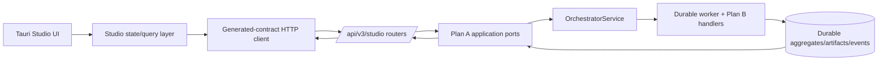

# Plan C — Studio API, Desktop UI & Integration Verification (S11–S15)

## Plan charter

### Purpose

Deliver the additive `/api/v3/studio` product surface and a real Tauri desktop workflow for Series, Episodes, Story artifacts, reviews, approvals, revisions, and screenplay locking. Plan C also owns the end-to-end certification that proves the product crosses the public API, canonical orchestrator, durable worker, real provider/model, persistence, review/revision, and immutable lock path without fake or hardcoded shortcuts.

### Scope

- S11 modular V3 Studio API, application mapping, idempotency/concurrency/errors, run status/events, and V2 deprecation metadata.
- S12 schema-derived TypeScript contracts, real HTTP client, Studio state, and platform integration.
- S13 Tauri Studio information architecture, Series/Episode navigation, Story workflow, approval/review/revision/lock UI.
- S14 API/UI integration, restart/recovery behavior, removal of production-path fakes/sample IDs, accessibility and build/test quality.
- S15 real happy-path and failure/recovery vertical slices, fresh evidence bundle, and master acceptance report.

### Non-goals

- Domain, persistence, orchestration, queue/worker, provider adapter, and engine capability implementation — Plan A.
- Story artifact/prompt/scoring/generation/review algorithm implementation — Plan B.
- Deleting V2, making Web a certified product, implementing Unreal, running renderer production, or producing a final video.
- Embedding provider credentials, direct worker/queue access, client-side state authority, or a UI-only simulated completion path.

### Current code evidence

- **OBSERVED:** V2 production and screenplay routers provide useful optimistic concurrency, idempotency, diff/impact, and lock-validation patterns.
- **OBSERVED:** `/api/v3/studio` is absent; central API composition/main files are conflict hotspots.
- **OBSERVED:** frontend `production-contracts`, `production-client`, `production-state`, `production-platform`, and `production-ui` packages are substantial reuse candidates.
- **OBSERVED:** the active desktop production page explicitly constructs `FakeProductionApiClient`; client/shell paths contain fixed IDs and synthesized revision data.
- **OBSERVED:** desktop tests currently pass 106 tests, but `production-ui` package has a pre-existing `describe is not defined` test-runner failure.
- **OBSERVED:** Tauri is the active product shell. Web can support build/test but cannot satisfy Roadmap 1 certification alone.

### Target architecture

The desktop observes durable run state/events. It never marks a stage complete optimistically beyond a pending indicator, and it never synthesizes an artifact, revision, receipt, or terminal state.

## Ownership and dependencies

### Owned modules and expected files

Plan C is the only plan allowed to create or materially edit:

- `apps/api/windagent_api/routers/v3/studio/**` — small resource routers, request/response mapping, dependencies, error mapping.
- one new V3 aggregator plus one narrow include in `apps/api/windagent_api/main.py`.
- API-facing application adapters only if they live under `apps/api/**`; canonical application services remain Plan A.
- `frontend/packages/studio-contracts/**`, `studio-client/**`, `studio-state/**`, `studio-platform/**`, `studio-ui/**`, or narrowly approved additions to existing `production-*` packages.
- `apps/desktop/src/**` for Studio routes/pages/composition/config and removal of fake/sample paths.
- frontend root workspace/lockfiles as the single lockfile owner.
- V3 API tests, frontend contract/state/UI tests, desktop/Tauri tests, end-to-end/certification harness and reports.
- `.github/workflows/ci.yaml` only during the final integration phase, after A/B supply their commands/manifests.

### Forbidden files/areas

- Plan A core Studio aggregate/port/event files, storage/migrations/outbox/queue/worker/provider/orchestrator code.
- Plan B Story content models, prompts, handlers, scoring/review/revision algorithms.
- direct edits to Blender/VP3D or legacy workflow engines.
- a second API-side domain schema, direct SQL/repository/provider client construction in routers, or production code selecting `FakeProductionApiClient`.
- hardcoded project/episode/revision/artifact IDs or canned rabbit/kite output in production packages.

### Inputs

- A application ports, errors, state/events, idempotency/version semantics, capability profile, and composition providers.
- B artifact schema bundle, summaries, validation/finding codes, diff/receipt/package views, and golden/invalid fixtures.
- Bootstrap V3 route/error contract and both consumer-contract documents.

### Outputs

- V3 OpenAPI surface and contract tests.
- Schema-derived TypeScript contracts and a real HTTP client.
- Tauri Studio UI covering the Roadmap 1 lifecycle.
- Automated happy-path/failure/recovery certification and fresh evidence.
- V2 deprecation metadata with zero silent breakage.

## API and UI authority rules

1. Routers validate/authenticate/map and call Plan A services; they do not orchestrate or persist.
2. Long-running commands return `202` and a durable run resource. Poll/event read models are the authority for progress.
3. The client generates idempotency keys per user intent and preserves them across network retry; it sends expected revision/version/hash for decisions.
4. Server artifacts/receipts are canonical. Client drafts are clearly local and cannot overwrite locked server state.
5. Production composition must have no fake client/runtime/provider. Test/storybook fakes live in explicitly named test modules and are excluded from production bundles.
6. All run errors distinguish retryable dependency failures, validation/review waits, conflicts, cancellation, and terminal failure with accessible recovery actions.

## Detailed phases

### C0 — Consume contracts and establish generation/test harness

| Required item | Execution detail |
|---|---|
| Objective | Make A/B contracts executable in API and TypeScript tests before implementing product behavior. |
| Inspection | Inventory V2 routers/error/idempotency dependencies, OpenAPI generation, frontend workspaces/build tools, current contracts/client/state patterns, desktop routing/composition, fake imports, hardcoded IDs, and UI test-runner setup. |
| Steps | 1. Add V3 contract fixtures and OpenAPI snapshot boundary. 2. Select one schema-generation/mapping path from A/B JSON schema to TypeScript and document it. 3. Add drift check to CI-local commands. 4. Classify every fake/sample ID occurrence as test-only, demo-only, or production defect. 5. Reproduce and fix the `production-ui` test-runner setup defect in a standalone commit without changing product semantics. |
| Migration | No API route or user-visible switch yet. Generated artifacts are checked according to repository convention; avoid two competing sources of truth. |
| Compatibility | Existing frontend packages/builds and V2 OpenAPI remain stable. Test setup repair must not mask failing tests. |
| Tests | Schema fixture generation, Python↔TypeScript round trips, OpenAPI snapshot harness, all current package/desktop tests, production-bundle import scan for fake modules. |
| Evidence | Fake/sample inventory, test baseline before/after, generator version/checksum, contract drift report. |
| Gate | `C_CONTRACT_CONSUMER_GATE`: A/B fixtures generate and validate; frontend baseline has no unclassified runner failure. |
| Rollback | Revert harness/setup commit; no API or production route changed. |

Parallelism: API fixture harness and frontend schema/test harness may proceed concurrently; workspace config/lockfile has one owner.

### C1 — Modular `/api/v3/studio` application surface (S11)

| Required item | Execution detail |
|---|---|
| Objective | Expose the frozen Studio resources/commands through small routers backed only by A application ports. |
| Inspection | V2 dependency providers, auth/actor extraction, idempotency store, optimistic version errors, media token patterns, application composition, health/readiness, and restart behavior. |
| Steps | 1. Create resource routers for series, episodes, runs/events, artifacts, idea selection, approvals, revisions, and screenplay lock. 2. Add one V3 aggregator and one narrow `main.py` include. 3. Map A commands/results/errors to frozen status/error payloads. 4. Require idempotency key and expected revision/version/hash on mutations. 5. Return durable run links/status, not synchronous generated results. 6. Add capability/readiness view needed by the desktop and certification. 7. Add V2 deprecation headers/docs without removing or redirecting V2. |
| Migration | Add V3 alongside V2. Start read endpoints and command contract tests before enabling production Studio write composition. No V2 database or response rewrite. |
| Compatibility | V2 route snapshots/tests remain green; clients receive only additive deprecation metadata. Existing auth/security policy applies to V3. |
| Tests | Route/method/status contract, auth/authorization, validation/redaction, all error mappings, idempotent replay/mismatch, optimistic conflicts, approval/lock stale hashes, durable restart/read status, V2 regressions. |
| Evidence | OpenAPI checksum, endpoint matrix, contract/junit report, restart/idempotency traces, redaction review, V2 comparison. |
| Gate | `STUDIO_API_GATE`: all frozen endpoints call A services, survive API restart, and pass consumer/error/idempotency contracts. |
| Rollback | Remove/disable only the V3 router include; V2 and durable state remain intact. |

Parallelism: independent resource routers/tests may proceed concurrently against A service fakes; aggregator, global error mapping, and `main.py` are serialized. Real-service integration waits for A handoff.

### C2 — Studio contracts, HTTP client, and state (S12)

| Required item | Execution detail |
|---|---|
| Objective | Replace synthesized/fake production data with schema-derived V3 requests, responses, caching, commands, and durable run state. |
| Inspection | Existing client base URL/auth/error code, query keys, production state reducers, platform abstraction, fake client, `vp_001`/`proj-alpha` paths, and build-time environment selection. |
| Steps | 1. Generate or checked-map A/B schemas into `studio-contracts`. 2. Implement `HttpStudioApiClient` for every frozen endpoint with abort/timeouts/retries only where safe. 3. Implement state/query layer for list/detail, run polling/event cursor, optimistic pending commands, invalidation, conflicts, and restart hydration. 4. Keep idempotency key stable across transport retries. 5. Add explicit capability-unavailable and unsupported-schema states. 6. Remove fake/default client selection from production composition; retain fakes only in test/storybook imports. |
| Migration | Introduce Studio packages alongside production packages. Adapt shared primitives rather than renaming all packages. Migrate one desktop route at a time after tests. |
| Compatibility | Existing V2 production client remains for existing screens during transition. No method silently changes from real to synthesized data. |
| Tests | Request/response fixtures, error/retry/idempotency, query invalidation, stale event cursor, conflict resolution, restart hydration, unknown artifact version, network loss, no fixed ID/default revision, production bundle fake-import scan. |
| Evidence | Generated-schema checksum, client contract report, state transition coverage, bundle dependency graph, fixed-ID scan. |
| Gate | `STUDIO_CLIENT_STATE_GATE`: real client/state pass V3 contract tests and production composition contains no fake/sample fallback. |
| Rollback | Keep old V2 screen route available; disable incomplete Studio navigation rather than substitute fake data. |

Parallelism: generated contracts/client and state reducers can proceed concurrently after request/result shapes freeze; production composition and lockfile edits are serialized.

### C3 — Tauri Studio shell, Series, and Episode navigation (S13 foundation)

| Required item | Execution detail |
|---|---|
| Objective | Provide route-driven Studio navigation and real aggregate selection with accessible loading/empty/error/recovery states. |
| Inspection | Desktop route system, `ProductionWorkspacePage`, `ProductionShell`, current Script/Assets/Video navigation, shared layout/theme/accessibility components, Tauri config and API URL injection. |
| Steps | 1. Add Studio route/shell and Story/Assets/Production product areas while keeping existing routes reachable. 2. Add Series list/create/detail and Episode list/create/detail using route params. 3. Replace initial `proj-alpha`/`vp_001` assumptions with URL/server selection. 4. Show revision/state/approval/capability/run summary from server. 5. Add accessible loading, empty, permission, offline, conflict, and unsupported-version states. 6. Verify Tauri runtime configuration chooses real HTTP client. |
| Migration | Ship behind an explicit Studio feature/navigation flag until API/client gates pass. Preserve existing production workspace as compatibility route. |
| Compatibility | Deep links and refresh rehydrate from route/server; existing desktop tests/navigation remain green. Web renders for tests but is not the acceptance target. |
| Tests | Component/route integration, no-data/create flow, deep link/refresh, invalid IDs, auth/network/capability states, keyboard/focus/accessibility, Tauri configuration, no fake import/default ID. |
| Evidence | Route map, test report, accessibility checks, Tauri screenshot/video optional, production bundle scan. |
| Gate | `STUDIO_DESKTOP_SHELL_GATE`: Tauri loads real Series/Episode resources with no sample identifier or fake client. |
| Rollback | Disable Studio navigation flag; leave V2 workspace route intact. |

Parallelism: shell/navigation and Series/Episode presentational components may proceed concurrently using contract fixtures; route/composition integration is serialized.

### C4 — Idea, bibles, beats, and outline workflow UI (S13 Story)

| Required item | Execution detail |
|---|---|
| Objective | Let users start/observe a Story run, compare/select ideas, inspect bibles/canon, review beats/outline, and act at approval checkpoints. |
| Inspection | B artifact fixtures/summaries, A run/wait states/events, current panels/tables/forms, long Vietnamese text behavior, approval authorization, and event polling constraints. |
| Steps | 1. Add run start/resume view with durable stage/task progress and wait reason. 2. Render 3–5 idea comparison cards with score dimensions/provenance; selection submits exact set hash/revision. 3. Render Story/World/Character bibles with validation findings. 4. Render beat sheet and timed episode outline. 5. Add approve/reject/request-revision controls only when policy/role/state permit. 6. Handle stale conflict by refetching and showing server truth. 7. Preserve event cursor across navigation/restart. |
| Migration | Components initially run against golden fixtures only in tests/storybook; the production route is enabled only with real client/state. No fixture response is bundled as runtime fallback. |
| Compatibility | Unknown optional fields are ignored safely; unknown artifact discriminators display an unsupported-version state rather than a blank screen. |
| Tests | Candidate count/selection, score and long-text rendering, bibles references, timing display, all approval modes, authorization, stale hash/version, reconnect/event dedup, accessibility and localization-safe layout. |
| Evidence | B fixture parity report, interaction tests, approval command traces, accessibility report, screenshots as supplemental evidence only. |
| Gate | `STORY_UI_GATE`: real API-backed workflow reaches approved outline and survives refresh/conflict without losing durable state. |
| Rollback | Hide incomplete action controls and retain read-only artifact/run views; never locally advance state. |

Parallelism: artifact read views can develop independently; approval/run-progress state is shared and has one integrator.

### C5 — Screenplay, review, revision, approval, and lock UI (S13–S14)

| Required item | Execution detail |
|---|---|
| Objective | Display structured/derived screenplay, explain review findings and diffs, support bounded revision/approval, and issue a hash-bound lock command. |
| Inspection | Existing screenplay editor/view/diff/impact/lock components and state, B schemas/fixtures, A lock/derive rules, conflict and permissions behavior. |
| Steps | 1. Reuse screenplay presentation primitives through adapters to the V3 structured draft. 2. Show scenes/action/dialogue/timing and canon/beat traceability. 3. Show review summary/findings with stable code/severity/location and provider/prompt diagnostics. 4. Render immutable before/after revision diff and iteration budget. 5. Submit approval/revision commands with exact revision/artifact hash. 6. Present lock confirmation, server receipt, lineage/checksum, and `READY_FOR_PRODUCTION`. 7. After lock, make the view read-only and route edits through derive-new-revision. |
| Migration | Preserve V2 screenplay workspace. Share rendering components where contract adapters are explicit; do not mutate their V2 state model invisibly. |
| Compatibility | Legacy screenplay text may render with conversion warnings. Only a V3 server receipt can mark Studio content locked/ready. |
| Tests | Structured screenplay rendering, duration/traceability, findings navigation, diff, iteration exhaustion, all approval modes, stale/concurrent lock, double-submit idempotency, post-lock read-only/derive flow, accessibility, refresh. |
| Evidence | UI/API command correlation, receipt view snapshot, immutable revision/diff report, interaction/accessibility tests, fake/hardcode scan. |
| Gate | `API_UI_INTEGRATION_GATE`: Tauri drives real V3 services through review, revision, approval, and lock with server state as authority. |
| Rollback | Disable mutating controls and retain read-only data. A locked revision is never unlocked; corrections derive a new revision. |

Parallelism: screenplay renderer, findings/diff views, and lock receipt view may develop concurrently; command/state integration is serialized.

### C6 — Build, packaging, security, and compatibility verification (S14)

| Required item | Execution detail |
|---|---|
| Objective | Make the integrated API/desktop surface reproducible, secure, and regression-safe before real-slice certification. |
| Inspection | Python/frontend/desktop test matrices, Tauri build config, API URL/auth/CORS, logging/redaction, source maps, bundle dependency graph, V2 route snapshots, version sources, and CI artifact conventions. |
| Steps | 1. Run API, generated-contract, client/state/UI, desktop, and Tauri build/test matrices. 2. Run production-bundle scans for fakes/sample IDs/dev endpoints/secrets. 3. Validate auth/authorization, redacted errors/logs, request size/rate/timeout behavior. 4. Test API/worker/desktop restart and network loss. 5. Re-run V2 compatibility and shared package suites. 6. Resolve version source/drift with A; do not fake checker evidence. 7. Add deterministic CI jobs/evidence uploads as the sole CI-workflow editor. |
| Migration | Studio feature flag moves from internal to certification candidate only after all checks pass. V2 remains enabled. |
| Compatibility | No unclassified regression from recorded baseline; pre-existing failures must be retired by their assigned gate, not waived silently. |
| Tests | Full relevant Python and frontend matrices, Tauri build/smoke, security/error tests, architecture/version/event/duplicate/workspace checkers, V2/VP3D regression. |
| Evidence | CI run IDs, dependency/tool versions, OpenAPI/schema/bundle checksums, junit/coverage, security/redaction scan, Tauri artifact checksum. |
| Gate | `RELEASE_CANDIDATE_GATE`: green reproducible build/test/checker set with real-only production composition. |
| Rollback | Keep Studio feature disabled; revert isolated CI/composition change without deleting durable data. |

Parallelism: security/bundle analysis, V2 regression, and build matrices can run concurrently. CI workflow and release manifest have one owner.

### C7 — Mandatory real happy-path vertical slice (S15)

| Required item | Execution detail |
|---|---|
| Objective | Prove the complete Roadmap 1 product path with a real Vietnamese short-story scenario and no bypass. |
| Inspection | Certification profile, provider credentials/route readiness, database/worker independence, API and Tauri endpoints, contract versions, empty test namespace, evidence redaction, approval policy. |
| Steps | 1. Start a real database-backed API and a separate worker process with `WINDAGENT_FAKE_RUNTIME` unset/false and mock/emergency fallbacks prohibited. 2. Verify capability endpoint names a real model/provider route and durable dependencies. 3. Through public V3 API or Tauri UI, create a Series and Episode with brief: Vietnamese story about a rabbit and a kite, audience ages 5–8, target 3–5 minutes. 4. Start run through `OrchestratorService`. 5. Observe durable generation/evaluation of 3–5 ideas; select via public command. 6. Observe persisted bibles/canon, beats, timed outline, structured screenplay. 7. Complete required approvals; force at least one genuine review finding and revision through policy/fixture criteria without hardcoding content. 8. Approve and lock exact reviewed hash. 9. Verify receipt, immutable revision, lineage, final `READY_FOR_PRODUCTION` state/event, and desktop display. 10. Correlate API/run/node/task/lease/provider/artifact/revision/approval/outbox/event IDs. |
| Migration | Run in a fresh namespaced certification dataset. Do not delete it automatically; retain according to evidence/data-retention policy for audit. |
| Compatibility | The run uses only public/canonical paths. Test support may choose thresholds/policy to exercise revision, but cannot inject generated artifacts/results or mark tasks complete. |
| Tests | Automated end-to-end assertions for every hop and artifact; content assertions cover Vietnamese language, rabbit/kite premise, age suitability, 180–300 second estimate, candidate count, complete lineage, real route provenance, revision count >= 1, immutable lock. |
| Evidence | Redacted input, IDs/correlations, state/event timeline, artifact/revision hashes, prompt/schema/model route receipts, quality/duration report, approval/lock receipt, Tauri/API screenshots/logs, process/build versions. |
| Gate | `REAL_VERTICAL_SLICE_GATE`: every hop is proven from durable evidence; any fake/mock/bypass/hardcoded result or missing revision makes the gate fail. |
| Rollback | On failure, stop new certification work, preserve namespace/logs, classify the first broken hop, and rerun from a new Episode/revision after the owning plan fixes it. Never edit persisted evidence to manufacture success. |

This phase is sequential at its public workflow level, even though API, worker, database, provider, and desktop run concurrently as processes.

### C8 — Mandatory failure and recovery slice (S15)

| Required item | Execution detail |
|---|---|
| Objective | Demonstrate that durable state, idempotency, leases, and UI recovery work under realistic interruption and conflict. |
| Inspection | A failure-injection points, worker lease TTL, provider retry classification, API restart, event cursor, idempotency store, lock concurrency, and desktop reconnect behavior. |
| Steps | 1. Start a second certification Episode. 2. Inject one controlled worker termination after durable claim and before finalization; restart worker and verify lease takeover/fencing with no duplicate canonical artifact. 3. Inject/replay an API timeout after a mutating request; reuse idempotency key and verify one result. 4. Restart API/desktop and recover run from durable state/event cursor. 5. Exercise stale approval/lock conflict and show server truth. 6. Exercise provider-unavailable/capability-unavailable fail-closed state, then resume after restoration if supported. 7. Verify outbox/event ordering and final reconciliation. |
| Migration | Failure switches exist only in test/certification harnesses and cannot be enabled by an untrusted production request. |
| Compatibility | No persistent schema cleanup or manual state edit is permitted. Recovery uses public/admin-safe canonical mechanisms. |
| Tests | Automated kill/restart, stale fence, duplicate delivery, idempotent replay, event dedup/order, network reconnect, stale hash conflict, capability unavailable/recovery. |
| Evidence | Failure timeline, lease generations/fencing tokens redacted as needed, artifact counts/hashes, event sequences, retry classifications, UI recovery capture. |
| Gate | `RECOVERY_VERTICAL_SLICE_GATE`: recovery completes without duplicate artifact, double approval/lock, lost run state, fake fallback, or manual database repair. |
| Rollback | Preserve failed namespace, disable injection switches, and return issue to A/B/C owner by first broken boundary. |

### C9 — Final certification and evidence handoff

| Required item | Execution detail |
|---|---|
| Objective | Produce one fresh, internally consistent master acceptance result for all Roadmap 1 gates. |
| Inspection | Review A/B/C handoff manifests, all gate evidence, baseline defects, contract/schema versions, migration head, CI SHA, real-slice namespaces, security/redaction, and VP3D/V2 regressions. |
| Steps | 1. Re-run final deterministic checker/test/build matrix at one integration SHA. 2. Validate evidence timestamps/SHA/checksums and reject stale or mixed-run artifacts. 3. Confirm every baseline failure is fixed or remains explicitly outside acceptance; architecture/version/UI setup failures must be fixed. 4. Confirm no fake/hardcode/bypass paths in production bundle/composition. 5. Publish master gate table with evidence links, owner, result, and limitations. 6. Keep raw logs as CI artifacts and only deterministic manifests/reports in Git. |
| Migration | No last-minute schema or contract change. Any such change reopens its upstream gate and requires a new certification run. |
| Compatibility | V2 and VP3D protection gates are part of final status, not optional appendices. |
| Tests | Master matrix in `90_MASTER_ACCEPTANCE_GATES.md`, including real happy/recovery slices and full relevant regressions. |
| Evidence | One signed/checksummed bundle index tied to integration SHA; redacted raw evidence locations and retention. |
| Gate | `FINAL_CERTIFICATION_GATE`: every mandatory master gate passes at the same compatible contract/integration revisions. |
| Rollback | Do not promote. Disable Studio feature, preserve evidence/data, and return to the first failed upstream gate. |

## Parallel and sequential execution within Plan C

Hard sequence: `C0 -> C1/C2 -> C3 -> C4 -> C5 -> C6 -> C7 -> C8 -> C9`. C1 and C2 can work concurrently against frozen fixtures. C3 presentation work may overlap late C2. C4/C5 components can overlap after B schemas freeze, but real command wiring follows A/B integration gates. C7 and C8 are separate certification runs; C9 follows both.

Safe parallel lanes:

- Independent API resource routers/tests.
- Generated client contracts vs. state reducers.
- Series/Episode shell vs. read-only Story artifact views.
- Screenplay renderer vs. review/diff/receipt presentational components.
- Build matrix, security scan, and V2/VP3D compatibility checks.

Serialized hotspots: `apps/api/.../main.py`, API composition, global error mapping, frontend workspace config/root lockfiles, desktop route composition, shared state command layer, `.github/workflows/ci.yaml`, and final evidence index.

## Plan-specific risks and conflict points

| Risk | Signal | Mitigation/owner | Rollback trigger |
|---|---|---|---|
| V3 router becomes another orchestration layer | Router submits task/marks state directly | service-only dependency contract/check | Any route bypasses OrchestratorService |
| Production still uses fake/default data | fake import, sample ID, synthesized revision in bundle | inventory + bundle AST/text scan + composition test | Any certification path resolves fake/default |
| Type drift between Python and TypeScript | manual duplicate schema or fixture mismatch | generation/mapping drift check | A/B fixture cannot round-trip |
| UI optimistically claims durable completion | state advances without event/server result | pending-only optimistic policy | refresh reveals a different stage/lock |
| Central-file merge conflicts | mixed A/C composition or CI edits | ownership sequencing and narrow aggregators | conflict obscures behavior ownership |
| “E2E” bypasses public boundary | harness calls service/repository or injects artifacts | start only through V3/Tauri; evidence correlations | missing API/orchestrator/worker/provider hop |
| Real-provider run leaks secrets/content | raw headers/credentials/logs in evidence | redaction tests and evidence review | secret scanner/redaction failure |
| Desktop passes but Tauri packaging fails | Web-only validation | required Tauri build/smoke/checksum | no runnable Tauri artifact |

## Acceptance criteria

Plan C is accepted only when:

- `/api/v3/studio` implements the frozen resources/commands/errors and calls only A application ports.
- V2 remains functional with additive deprecation metadata and no unclassified regression.
- TypeScript contracts derive from A/B schemas; client/state handle idempotency, concurrency, event cursor, restart, errors, and unknown versions.
- Tauri Studio has real route-driven Series/Episode navigation and all Story/review/revision/approval/lock views; production composition has no fake/sample fallback.
- All frontend/API/Tauri/build/security/version/architecture compatibility gates pass with fresh evidence.
- The mandatory Vietnamese rabbit/kite slice, ages 5–8 and 3–5 minutes, crosses real API -> orchestrator -> durable worker -> real provider/model -> persistence -> review -> revision -> approval -> lock and displays the server receipt/state.
- The mandatory failure/recovery slice proves lease takeover/fencing, idempotent replay, restart recovery, conflicts, and fail-closed provider capability behavior without manual DB repair.
- Final evidence is tied to one integration SHA and contains no stale/mixed-run PASS claims or secrets.

## Plan C final verdict target

Do not claim this verdict from planning alone. The implementation branch may report `WIND_STUDIO_PLAN_C_PRODUCT_INTEGRATION_READY` only after `FINAL_CERTIFICATION_GATE` passes. Otherwise it reports the first failed gate and does not promote Roadmap 1.
