# Parallel Execution Matrix

## Roadmap ownership and traceability

Roadmap 1 is decomposed into exactly three execution plans plus the short non-implementation `PARALLEL_BOOTSTRAP_GATE`.

| Roadmap stage | Primary plan | Deliverable | Mandatory upstream |
|---|---|---|---|
| S0 | A | Current truth/evidence authority | Bootstrap |
| S1 | A | Architecture boundaries and authority fences | S0 |
| S2 | A | Studio aggregates, revisions, approvals, ports, persistence | S1 + frozen contract |
| S3 | A | Durable orchestration/worker/provider/capabilities/recovery | S2 |
| S4 | B | Brief normalization and 3–5 idea generation | A contract/model port fixture |
| S5 | B | Evaluation/selection semantics | S4 + A approval command |
| S6 | B | Story/World/Character bibles/canon | S5 |
| S7 | B | Beat sheet and timed outline | S6 |
| S8 | B | Structured screenplay generation/validation | S7 |
| S9 | B | Review and bounded immutable revision | S8 + A revision/task contracts |
| S10 | B with A lock authority | Lock-ready package and receipt flow | S9 + A lock/persistence/runtime |
| S11 | C | `/api/v3/studio` | A app ports; B schemas for artifact endpoints |
| S12 | C | Generated contracts/client/state | S11 contract + A/B fixtures |
| S13 | C | Tauri Studio workflow UI | S12 + B artifacts |
| S14 | C | Integrated builds/security/compatibility | A/B handoff + S13 |
| S15 | C integration owner; A/B fix owned layers | Real happy/recovery slices and final certification | All integration gates |

## Typed dependency ledger

| From | To | Type | Contract/deliverable | Can consumer start before producer finishes? |
|---|---|---|---|---|
| Bootstrap | A/B/C | hard | v0.1 names, ownership, fixtures, baseline classification | No |
| A2 | B1–B8 | contract | aggregate/envelope/approval/revision/model-port fixtures | Yes, after freeze; runtime integration waits |
| A2 | C1–C5 | contract | app commands/results/errors/state/events | Yes, using service fixtures |
| B1 | C2–C5 | contract | artifact schemas/golden/invalid fixtures | Yes, after artifact gate |
| B2–B8 | A5 | integration | handler registry, capabilities, results | A can build registry/harness; real handler gate waits |
| A3 | B9 | hard | artifact/revision/approval persistence and UoW | No for persistence integration; pure B work continues |
| A4–A6 | B9 | hard | durable submission/worker/model adapter | No for real runtime claim |
| A3–A6 | C1/C6–C8 | integration | real application composition/run status/capability | C can build routes; real gate waits |
| B3–B8 | C4–C5 | integration | real artifacts/findings/diffs/receipt content | C can render fixtures; real gate waits |
| A checkers/VP3D suites | C6/C9 | test | final architecture/runtime/compatibility commands | Yes; C invokes stable versions at final |
| B schema/quality fixtures | C0/C2/C6/C9 | test | Python↔TS drift and product acceptance assertions | Yes after B1/B2 gates |
| A capability profile | future production engine work | optional | Blender/Unreal discovery extension | Excluded from R1 critical path |

## Execution waves

### Wave 0 — `PARALLEL_BOOTSTRAP_GATE` (all owners, short and sequential)

| A contribution | B contribution | C contribution | Exit |
|---|---|---|---|
| Freeze IDs/states/tasks/events/ports, migration owner, baseline evidence | Freeze artifact types/quality/prompt provenance/handler payload needs | Freeze HTTP/resources/errors/schema-generation and UI consumer needs | Signed v0.1 fixtures, ownership, branch/merge calendar, no `NEEDS_DECISION` |

No production code starts before Wave 0 exits.

### Wave 1 — Independent foundations

| Plan A lane | Plan B lane | Plan C lane | Parallel status |
|---|---|---|---|
| A0 evidence fixtures; A1 boundary repair/legacy guards; begin A2 pure domain/ports | B0 reuse ledger/consumer tests; B1 Story schemas; begin B2 prompt/schema boundary | C0 OpenAPI/TS harness, fake/sample inventory, UI runner setup fix; begin modular route/client shells against fixtures | Fully parallel after bootstrap; no shared production files |

Wave 1 integration event: `STUDIO_DOMAIN_INTEGRATION_GATE` from A and `STORY_ARTIFACT_CONTRACT_GATE` from B. C regenerates consumer fixtures in a dedicated commit.

### Wave 2 — Persistence, generation pipeline, and product shells

| Plan A lane | Plan B lane | Plan C lane | Parallel status |
|---|---|---|---|
| A3 migration/repositories/UoW/outbox; A4 DAG/durable submission | B3 ideas; B4 bibles; B5 beats/outline | C1 V3 routers using A service fixtures; C2 real client/state; C3 route-driven Tauri shell | Parallel by contract. C’s routes are not called “integrated”; B uses in-memory/contract repository fixtures until A3 gate |

Wave 2 integration events:

1. `STUDIO_PERSISTENCE_GATE`: B repository contract tests move to A adapters.
2. `DURABLE_ORCHESTRATION_GATE`: C start/status contract runs against A application services.
3. `IDEA_GATE`, `STORY_BIBLE_GATE`, and `OUTLINE_GATE`: C may replace fixtures with real read models stage by stage.

### Wave 3 — Runtime screenplay and real UI wiring

| Plan A lane | Plan B lane | Plan C lane | Parallel status |
|---|---|---|---|
| A5 worker/finalizer/recovery; A6 provider adapter/capabilities | B6 screenplay; B7 review/revise; B8 approval/lock package; B9 handler integration | C4 Story workflow; C5 screenplay/review/revision/lock views; real service wiring only after gates | Components parallel; real end-to-end steps sequential at cross-plan gates |

Wave 3 gate order:

1. `STORY_WORKER_GATE` (A with a B contract handler).
2. `REAL_MODEL_RUNTIME_GATE` (A infrastructure with controlled B handler).
3. `SCREENPLAY_DRAFT_GATE` and `STORY_REVIEW_GATE` (B).
4. `SCREENPLAY_RUNTIME_GATE` (A+B real integrated handler chain).
5. `LOCKED_SCREENPLAY_GATE` (A+B authority/package/receipt).
6. `API_UI_INTEGRATION_GATE` (C drives public API and renders persisted results).

### Wave 4 — Release candidate, real slices, certification

| Plan A lane | Plan B lane | Plan C/integration lane | Parallel status |
|---|---|---|---|
| A7 full foundation/regression/handoff; fix only A-owned failures | B9 full story handoff; fix only B-owned failures | C6 release candidate; C7 happy path; C8 recovery; C9 master evidence/CI | Regression checks parallel; each public certification run is sequential and begins only after handoffs |

Exit order: `PLAN_A_HANDOFF_GATE` + `PLAN_B_HANDOFF_GATE` -> `RELEASE_CANDIDATE_GATE` -> `REAL_VERTICAL_SLICE_GATE` -> `RECOVERY_VERTICAL_SLICE_GATE` -> `FINAL_CERTIFICATION_GATE`.

## Critical path

```mermaid
flowchart LR
    PB[Bootstrap] --> A2[A2 domain/ports]
    A2 --> A3[A3 persistence]
    A3 --> A4[A4 durable orchestration]
    A4 --> A5[A5 worker/recovery]
    A5 --> AB[A+B handler runtime]
    PB --> B1[B1 artifact schemas]
    B1 --> B3[B3 ideas]
    B3 --> B4[B4 bibles]
    B4 --> B5[B5 outline]
    B5 --> B6[B6 screenplay]
    B6 --> B7[B7 review/revise]
    B7 --> B8[B8 lock package]
    B8 --> AB
    AB --> CINT[C API/UI real integration]
    CINT --> RC[Release candidate]
    RC --> E2E[Real happy + recovery slices]
    E2E --> FINAL[Final certification]
```

A6 real provider capability must join before `AB`; C0–C5 run in parallel off the critical path until `CINT`.

## Task-level concurrency matrix

Legend: `P` safe parallel; `S` serialize/handoff; `B` blocked by gate; `—` unrelated.

| Work item | A active | B active | C active | Constraint |
|---|---:|---:|---:|---|
| Contract fixtures | S | S | S | Joint freeze commit only |
| Architecture repair | P | B0/B1 P | C0 P | No shared files |
| A domain/ports | P | Consumer tests P | Consumer tests P | A owns definitions |
| B Story schemas | A envelope tests P | P | TS fixture tests P | B owns content definitions |
| Migration | P | Fixture supply only | Fixture supply only | A sole editor |
| Prompt/model services | A provider adapter P | P | Diagnostics fixture P | Provider port only |
| Orchestrator/queue/worker | P | Handler fixtures P | Run API fixture P | Real integration blocked until A gates |
| API V3 routers | A app fixture P | B schemas P | P | `main.py`/composition serialized |
| Frontend packages/desktop | — | Fixture review P | P | C sole editor/lockfile owner |
| Existing screenplay compatibility | A freeze then handoff S | B edit | C adapter only | No concurrent edit |
| CI workflow | supplies commands | supplies commands | C edit | Only Wave 4 |
| Happy-path certification | Support | Support | Sequential owner | All gates must pass |
| Recovery certification | Support | Support | Sequential owner | Separate namespace/run |

## Gate failure routing

| First failed boundary | Primary owner | Other plans do while blocked | Gate to rerun |
|---|---|---|---|
| Contract/schema/ownership mismatch | Integration owner + definition owner | Continue only unaffected pure work; no integration merge | `CONTRACT_FREEZE_GATE` or artifact gate |
| Aggregate/persistence/hash/approval | A | B/C use fixtures; avoid real writes | A2/A3 gate |
| Prompt/schema/content validation | B | A tests runtime with contract handler; C uses last valid fixtures | B stage gate |
| Queue/worker/provider/reconcile | A | B pure tests; C UI/API fixture tests | A4–A6 / runtime gate |
| HTTP/client/state/UI | C | A/B regressions and evidence prep | C1–C6 gate |
| Real content quality only | B | A/C preserve failed evidence; no threshold lowering | B review/duration gate then real slice |
| Real infra/credential/capability | A environment/integration owner | Run deterministic suites; do not substitute fake | real model/release gate |
| VP3D/V2 regression | Owner of introducing diff | No promotion; isolate regression | relevant plan handoff + release gate |

## Execution-control rules

- A plan may merge a contract-compatible internal slice before its full plan completes if its focused tests and consumer fixtures pass.
- “Works with fake” is only a unit-test milestone, never an integration gate.
- A downstream plan may develop against fixtures but must label results fixture-only; it cannot claim a real gate until producer evidence is present.
- No blanket cherry-pick of a plan branch. Merge/cherry-pick reviewed, single-purpose commits at gates.
- Any contract-breaking discovery returns to Wave 0 review for the affected contract, not a local workaround.
- Real certification runs only from the integration branch at one recorded SHA with clean generated artifacts and no uncommitted production changes.
